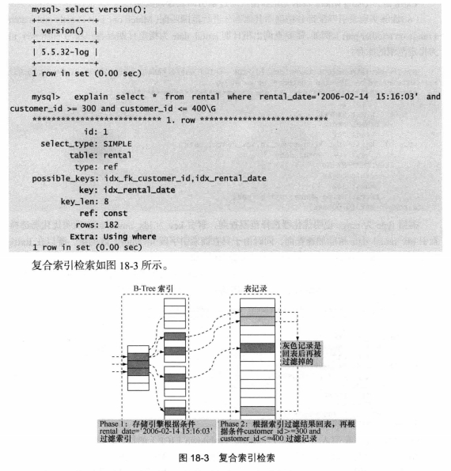
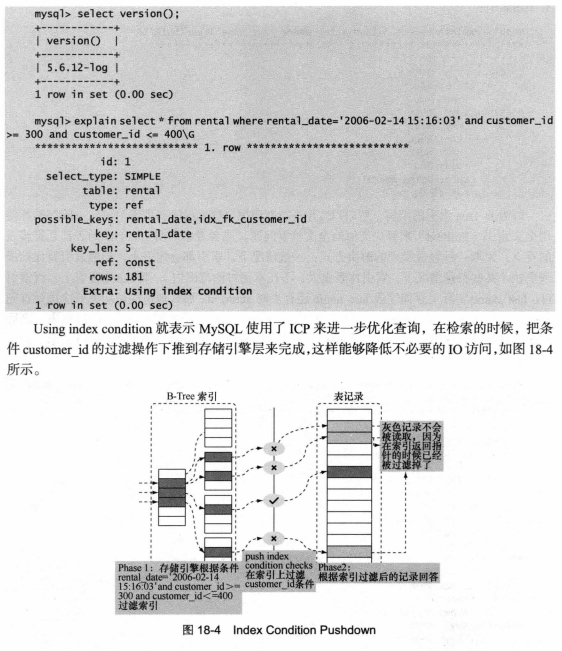

# 数据库开发、优化与管理维护（第2版）

## 日期时间类型

### timestamp 的使用

> 实际上 datetime 也可以声明为 default CURRENT_TIMESTAMP on update CURRENT_TIMESTAMP。
> 区别在于如果插入的值为 null 时，datetime 为 null，而 timestamp 为时间戳。

演示

```sql
mysql> create table demo (a int, b timestamp);
Query OK, 0 rows affected (0.03 sec)

mysql> desc demo;
+-------+-----------+------+-----+-------------------+-----------------------------+
| Field | Type      | Null | Key | Default           | Extra                       |
+-------+-----------+------+-----+-------------------+-----------------------------+
| a     | int(11)   | YES  |     | NULL              |                             |
| b     | timestamp | NO   |     | CURRENT_TIMESTAMP | on update CURRENT_TIMESTAMP |
+-------+-----------+------+-----+-------------------+-----------------------------+
2 rows in set (0.01 sec)

mysql> show create table demo\G
*************************** 1. row ***************************
       Table: demo
Create Table: CREATE TABLE `demo` (
  `a` int(11) DEFAULT NULL,
  `b` timestamp NOT NULL DEFAULT CURRENT_TIMESTAMP ON UPDATE CURRENT_TIMESTAMP
) ENGINE=InnoDB DEFAULT CHARSET=latin1
1 row in set (0.00 sec)

mysql> insert into demo values (1, null);
Query OK, 1 row affected (0.00 sec)

mysql> select * from demo;
+------+---------------------+
| a    | b                   |
+------+---------------------+
|    1 | 2018-08-19 18:16:43 |
+------+---------------------+
1 row in set (0.00 sec)

mysql> update demo set a = 2 where a = 1;
Query OK, 1 row affected (0.00 sec)
Rows matched: 1  Changed: 1  Warnings: 0

mysql> select * from demo;
+------+---------------------+
| a    | b                   |
+------+---------------------+
|    2 | 2018-08-19 18:17:05 |
+------+---------------------+
```

- [https://dev.mysql.com/doc/refman/5.7/en/timestamp-initialization.html](https://dev.mysql.com/doc/refman/5.7/en/timestamp-initialization.html)

## datetime 和 timestamp

演示

```sql
mysql> create table demo (a int, b datetime, c timestamp);
Query OK, 0 rows affected (0.05 sec)

mysql> desc demo;
+-------+-----------+------+-----+-------------------+-----------------------------+
| Field | Type      | Null | Key | Default           | Extra                       |
+-------+-----------+------+-----+-------------------+-----------------------------+
| a     | int(11)   | YES  |     | NULL              |                             |
| b     | datetime  | YES  |     | NULL              |                             |
| c     | timestamp | NO   |     | CURRENT_TIMESTAMP | on update CURRENT_TIMESTAMP |
+-------+-----------+------+-----+-------------------+-----------------------------+

mysql> insert into demo values (1, null, null);
Query OK, 1 row affected (0.01 sec)

mysql> select * from demo;
+------+------+---------------------+
| a    | b    | c                   |
+------+------+---------------------+
|    1 | NULL | 2018-08-19 18:28:29 |
+------+------+---------------------+
1 row in set (0.00 sec)

mysql> alter table demo modify b datetime default CURRENT_TIMESTAMP on update CURRENT_TIMESTAMP;
Query OK, 0 rows affected (0.02 sec)
Records: 0  Duplicates: 0  Warnings: 0

mysql> insert into demo values (1, null, null);
Query OK, 1 row affected (0.01 sec)

mysql> select * from demo;
+------+------+---------------------+
| a    | b    | c                   |
+------+------+---------------------+
|    1 | NULL | 2018-08-19 18:28:29 |
|    1 | NULL | 2018-08-19 18:29:39 |
+------+------+---------------------+
2 rows in set (0.00 sec)

mysql> update demo set a = 2 where a = 1;
Query OK, 2 rows affected (0.00 sec)
Rows matched: 2  Changed: 2  Warnings: 0

mysql> select * from demo;
+------+---------------------+---------------------+
| a    | b                   | c                   |
+------+---------------------+---------------------+
|    2 | 2018-08-19 18:29:59 | 2018-08-19 18:29:59 |
|    2 | 2018-08-19 18:29:59 | 2018-08-19 18:29:59 |
+------+---------------------+---------------------+
2 rows in set (0.00 sec)

mysql> alter table demo modify b datetime not null DEFAULT CURRENT_TIMESTAMP ON UPDATE CURRENT_TIMESTAMP
    -> ;
Query OK, 0 rows affected (0.13 sec)
Records: 0  Duplicates: 0  Warnings: 0

mysql> desc demo;
+-------+-----------+------+-----+-------------------+-----------------------------+
| Field | Type      | Null | Key | Default           | Extra                       |
+-------+-----------+------+-----+-------------------+-----------------------------+
| a     | int(11)   | YES  |     | NULL              |                             |
| b     | datetime  | NO   |     | CURRENT_TIMESTAMP | on update CURRENT_TIMESTAMP |
| c     | timestamp | NO   |     | CURRENT_TIMESTAMP | on update CURRENT_TIMESTAMP |
+-------+-----------+------+-----+-------------------+-----------------------------+
3 rows in set (0.00 sec)

mysql> select * from demo;
+------+---------------------+---------------------+
| a    | b                   | c                   |
+------+---------------------+---------------------+
|    2 | 2018-08-19 18:29:59 | 2018-08-19 18:29:59 |
|    2 | 2018-08-19 18:29:59 | 2018-08-19 18:29:59 |
+------+---------------------+---------------------+
2 rows in set (0.00 sec)

mysql> insert into demo values (1, null, null);
ERROR 1048 (23000): Column 'b' cannot be null
```

## enum 枚举类型

演示

```sql
mysql> create table demo (gender enum('M', 'F'));
Query OK, 0 rows affected (0.06 sec)

mysql> desc demo;
+--------+---------------+------+-----+---------+-------+
| Field  | Type          | Null | Key | Default | Extra |
+--------+---------------+------+-----+---------+-------+
| gender | enum('M','F') | YES  |     | NULL    |       |
+--------+---------------+------+-----+---------+-------+
1 row in set (0.00 sec)

mysql> insert into demo values ('M'), ('f'), (1), (null);
Query OK, 4 rows affected (0.06 sec)
Records: 4  Duplicates: 0  Warnings: 0

mysql> select * from demo;
+--------+
| gender |
+--------+
| M      |
| F      |
| M      |
| NULL   |
+--------+
4 rows in set (0.00 sec)
```

从上面例子中可以看出，ENUM 类型是忽略大小写的，在存储 “M” 和 “f” 时将它们都转成了大写，
还可以看出对于插入不在 ENUM 指定范围内的值时，并没有警告，而是插入了 enum('M', 'F') 的第一个值 “M”，这点用户使用时要特别注意。

另外，ENUM 类型只允许从值集合中选取单个值，而不能一次取多个值。

## SET 集合类型

演示

```sql
mysql> create table demo (col set('a', 'b', 'c', 'd'));
Query OK, 0 rows affected (0.01 sec)

mysql> desc demo;
+-------+----------------------+------+-----+---------+-------+
| Field | Type                 | Null | Key | Default | Extra |
+-------+----------------------+------+-----+---------+-------+
| col   | set('a','b','c','d') | YES  |     | NULL    |       |
+-------+----------------------+------+-----+---------+-------+
1 row in set (0.00 sec)

mysql> insert into demo values('a,b'), ('a,d,a'), ('a,c'), ('c');
Query OK, 4 rows affected (0.05 sec)
Records: 4  Duplicates: 0  Warnings: 0

mysql> select * from demo;
+------+
| col  |
+------+
| a,b  |
| a,d  |
| a,c  |
| c    |
+------+
4 rows in set (0.00 sec)

mysql> insert into demo values ('a,');
ERROR 1265 (01000): Data truncated for column 'col' at row 1
mysql> insert into demo values ('f');
ERROR 1265 (01000): Data truncated for column 'col' at row 1
```

SET 和 ENUM 除了存储以外，最主要的区别在于 SET 类型一次可以选取多个成员，而 ENUM 只能选一个。

SET 类型可以从允许的值集合中选取任意 1 个或多个元素进行组合，所以对于输入的值只要是在允许的组合范围内，
都可以正确地注入到 SET 类型的列中。对于超出允许范围的值例如（'a,b,f'）将不允许注入到上面的例子中设置的 SET 类型列中，
而对于（'a,b,a'）这样包含重复的成员的集合将只取一次，写入后的结果为 “a,b”，这一点请注意。

补充：多个元素时后面不能带逗号，否则插入失败。例如（'a,b,'）会插入失败。

查询的方式

```sql
mysql> select * from demo where FIND_IN_SET('a', col);
+------+
| col  |
+------+
| a,b  |
| a,d  |
| a,c  |
+------+
3 rows in set (0.00 sec)

mysql> select * from demo where col like "a%";
+------+
| col  |
+------+
| a,b  |
| a,d  |
| a,c  |
+------+
3 rows in set (0.00 sec)
```

- [11.4.5 The SET Type](https://dev.mysql.com/doc/refman/5.7/en/set.html)

## 时间函数

演示

```sql
mysql> select unix_timestamp('2018-8-20 14:54:54');
+--------------------------------------+
| unix_timestamp('2018-8-20 14:54:54') |
+--------------------------------------+
|                           1534748094 |
+--------------------------------------+
1 row in set (0.01 sec)

mysql> select from_unixtime(1534748094);
+---------------------------+
| from_unixtime(1534748094) |
+---------------------------+
| 2018-08-20 14:54:54       |
+---------------------------+
1 row in set (0.00 sec)

mysql> select now() current,
    > date_add(now(), INTERVAL 31 day) after31days,
    > date_add(now(), INTERVAL '1_2' year_month) after_oneyear_twomonth;
+---------------------+---------------------+------------------------+
| current             | after31days         | after_oneyear_twomonth |
+---------------------+---------------------+------------------------+
| 2018-08-20 15:03:00 | 2018-09-20 15:03:00 | 2019-10-20 15:03:00    |
+---------------------+---------------------+------------------------+

mysql> select now() current,
    > date_add(now(), INTERVAL -31 day) before31days,
    > date_add(now(), INTERVAL '-1_-2' year_month) before_oneyear_twomonth;
+---------------------+---------------------+-------------------------+
| current             | before31days        | before_oneyear_twomonth |
+---------------------+---------------------+-------------------------+
| 2018-08-20 15:04:41 | 2018-07-20 15:04:41 | 2017-06-20 15:04:41     |
+---------------------+---------------------+-------------------------+
1 row in set (0.00 sec)

mysql> select datediff('2019-09-09', NOW());
+-------------------------------+
| datediff('2019-09-09', NOW()) |
+-------------------------------+
|                           385 |
+-------------------------------+
1 row in set (0.00 sec)
```

- UNIX_TIMESTAMP(date) 返回日期的 Unix 时间戳
- FROM_UNIXTIME(timestamp) 返回 Unix 时间戳的日期值
- DATE_ADD(date, INTERVAL expr type) 返回一个日期或时间值加上一个时间间隔的时间值
- DATEDIFF(expr, expr) 返回起始时间和结束时间
- [12.7 Date and Time Functions](https://dev.mysql.com/doc/refman/5.7/en/date-and-time-functions.html)

## 流程函数

演示

```sql
mysql> create table demo (user_id int, salary decimal(10, 2));
Query OK, 0 rows affected (0.06 sec)

mysql> insert into demo values(1, 1000), (2, 2000), (3, 3000), (4, 4000), (5, 5000), (6, null);
Query OK, 6 rows affected (0.11 sec)
Records: 6  Duplicates: 0  Warnings: 0

mysql> select * from demo;
+---------+---------+
| user_id | salary  |
+---------+---------+
|       1 | 1000.00 |
|       2 | 2000.00 |
|       3 | 3000.00 |
|       4 | 4000.00 |
|       5 | 5000.00 |
|       6 |    NULL |
+---------+---------+
6 rows in set (0.00 sec)

mysql> select if(salary > 2000, 'high', 'low') from demo;
+----------------------------------+
| if(salary > 2000, 'high', 'low') |
+----------------------------------+
| low                              |
| low                              |
| high                             |
| high                             |
| high                             |
| low                              |
+----------------------------------+
6 rows in set (0.00 sec)

mysql> select ifnull(salary, 0) from demo;
+-------------------+
| ifnull(salary, 0) |
+-------------------+
|           1000.00 |
|           2000.00 |
|           3000.00 |
|           4000.00 |
|           5000.00 |
|              0.00 |
+-------------------+
6 rows in set (0.00 sec)

mysql> select case when salary <= 2000 then 'low' else 'high' end from demo;
+-----------------------------------------------------+
| case when salary <= 2000 then 'low' else 'high' end |
+-----------------------------------------------------+
| low                                                 |
| low                                                 |
| high                                                |
| high                                                |
| high                                                |
| high                                                |
+-----------------------------------------------------+
6 rows in set (0.00 sec)

mysql> select case salary when 1000 then 'low' when 2000 then 'mid' else 'high' end from demo;
+-----------------------------------------------------------------------+
| case salary when 1000 then 'low' when 2000 then 'mid' else 'high' end |
+-----------------------------------------------------------------------+
| low                                                                   |
| mid                                                                   |
| high                                                                  |
| high                                                                  |
| high                                                                  |
| high                                                                  |
+-----------------------------------------------------------------------+
6 rows in set (0.00 sec)
```

- [12.4 Control Flow Functions](https://dev.mysql.com/doc/refman/5.7/en/control-flow-functions.html)

## 其他函数

演示

```sql
mysql> select database();
+------------+
| database() |
+------------+
| mydb       |
+------------+
1 row in set (0.00 sec)

mysql> select version();
+-------------------------+
| version()               |
+-------------------------+
| 5.7.23-0ubuntu0.16.04.1 |
+-------------------------+
1 row in set (0.00 sec)

mysql> select user();
+----------------+
| user()         |
+----------------+
| root@localhost |
+----------------+
1 row in set (0.00 sec)

mysql> select password(123456);
+-------------------------------------------+
| password(123456)                          |
+-------------------------------------------+
| *6BB4837EB74329105EE4568DDA7DC67ED2CA2AD9 |
+-------------------------------------------+
1 row in set, 1 warning (0.00 sec)

mysql> select md5('123456');
+----------------------------------+
| md5('123456')                    |
+----------------------------------+
| e10adc3949ba59abbe56e057f20f883e |
+----------------------------------+
1 row in set (0.00 sec)
```

- [12.14 Information Functions](https://dev.mysql.com/doc/refman/5.7/en/information-functions.html)

## 存储引擎

查看所有引擎

```sql
mysql> show engines;
+--------------------+---------+----------------------------------------------------------------+--------------+------+------------+
| Engine             | Support | Comment                                                        | Transactions | XA   | Savepoints |
+--------------------+---------+----------------------------------------------------------------+--------------+------+------------+
| MyISAM             | YES     | MyISAM storage engine                                          | NO           | NO   | NO         |
| MRG_MYISAM         | YES     | Collection of identical MyISAM tables                          | NO           | NO   | NO         |
| CSV                | YES     | CSV storage engine                                             | NO           | NO   | NO         |
| BLACKHOLE          | YES     | /dev/null storage engine (anything you write to it disappears) | NO           | NO   | NO         |
| InnoDB             | DEFAULT | Supports transactions, row-level locking, and foreign keys     | YES          | YES  | YES        |
| PERFORMANCE_SCHEMA | YES     | Performance Schema                                             | NO           | NO   | NO         |
| ARCHIVE            | YES     | Archive storage engine                                         | NO           | NO   | NO         |
| MEMORY             | YES     | Hash based, stored in memory, useful for temporary tables      | NO           | NO   | NO         |
| FEDERATED          | NO      | Federated MySQL storage engine                                 | NULL         | NULL | NULL       |
+--------------------+---------+----------------------------------------------------------------+--------------+------+------------+
9 rows in set (0.00 sec)
```

## Memory 引擎的使用

MEMORY 类型的存储引擎主要用于那些内容变化不频繁的代码表，或者作为统计操作的中间表，
便于高效地对中间结果进行分析并得到最终的统计结果。
对于存储引擎为 MEMORY 的表进行更新操作要谨慎，因为数据并没有实际写入到磁盘中，
所以一定要对下次重启服务后如何获取这些修改后的数据有所顾虑。

给 Memory 表创建索引的时候，可以指定使用 HASH 索引还是 BTREE 索引。

```sql
mysql> create table demo (id int, name varchar(10)) engine memory;
Query OK, 0 rows affected (0.07 sec)

mysql> show table status like "demo"\G
*************************** 1. row ***************************
           Name: demo
         Engine: MEMORY
        Version: 10
     Row_format: Fixed
           Rows: 0
 Avg_row_length: 46
    Data_length: 0
Max_data_length: 16078150
   Index_length: 0
      Data_free: 0
 Auto_increment: NULL
    Create_time: 2018-08-20 22:09:24
    Update_time: NULL
     Check_time: NULL
      Collation: utf8mb4_unicode_ci
       Checksum: NULL
 Create_options:
        Comment:
1 row in set (0.00 sec)

mysql> alter table demo add index name using hash (name);
Query OK, 0 rows affected (0.02 sec)
Records: 0  Duplicates: 0  Warnings: 0

mysql> show create table demo\G
*************************** 1. row ***************************
       Table: demo
Create Table: CREATE TABLE `demo` (
  `id` int(11) DEFAULT NULL,
  `name` varchar(10) COLLATE utf8mb4_unicode_ci DEFAULT NULL,
  KEY `name` (`name`) USING HASH
) ENGINE=MEMORY DEFAULT CHARSET=utf8mb4 COLLATE=utf8mb4_unicode_ci
1 row in set (0.00 sec)

mysql> show index from demo\G
*************************** 1. row ***************************
        Table: demo
   Non_unique: 1
     Key_name: name
 Seq_in_index: 1
  Column_name: name
    Collation: A
  Cardinality: NULL
     Sub_part: NULL
       Packed: NULL
         Null: YES
   Index_type: HASH
      Comment:
Index_comment:
1 row in set (0.00 sec)

mysql> alter table demo drop index name;
Query OK, 0 rows affected (0.06 sec)
Records: 0  Duplicates: 0  Warnings: 0

mysql> show create table demo\G;
*************************** 1. row ***************************
       Table: demo
Create Table: CREATE TABLE `demo` (
  `id` int(11) DEFAULT NULL,
  `name` varchar(10) COLLATE utf8mb4_unicode_ci DEFAULT NULL
) ENGINE=MEMORY DEFAULT CHARSET=utf8mb4 COLLATE=utf8mb4_unicode_ci
1 row in set (0.00 sec)

mysql> alter table demo add index name using btree (name);
Query OK, 0 rows affected (0.05 sec)
Records: 0  Duplicates: 0  Warnings: 0

mysql> show create table demo\G
*************************** 1. row ***************************
       Table: demo
Create Table: CREATE TABLE `demo` (
  `id` int(11) DEFAULT NULL,
  `name` varchar(10) COLLATE utf8mb4_unicode_ci DEFAULT NULL,
  KEY `name` (`name`) USING BTREE
) ENGINE=MEMORY DEFAULT CHARSET=utf8mb4 COLLATE=utf8mb4_unicode_ci
1 row in set (0.00 sec)

mysql> show index from demo\G
*************************** 1. row ***************************
        Table: demo
   Non_unique: 1
     Key_name: name
 Seq_in_index: 1
  Column_name: name
    Collation: A
  Cardinality: NULL
     Sub_part: NULL
       Packed: NULL
         Null: YES
   Index_type: BTREE
      Comment:
Index_comment:
1 row in set (0.00 sec)
```

## Merge 引擎的使用

MERGE 表在磁盘上保留两个文件，文件名以表的名字开始，一个.frm文件存储表定义，
另一个.MRG文件包含组合表信息，包括MERGE表由哪些表组成，插入新的数据时的依据。
可以通过修改.MRG文件来修改 MERGE 表，但是修改后要通过 FLUSH TABLES 刷新。

通常我们使用 MERGE 表来透明地对多个表进行查询和更新操作，而对这种按时间记录的操作日志表则可以透明地进行插入操作。

```sql
mysql> create table demo1 (id int, name varchar(10), key idx1 (id)) engine myisam;
Query OK, 0 rows affected (0.03 sec)

mysql> create table demo2 (id int, name varchar(10), key idx1 (id)) engine myisam;
Query OK, 0 rows affected (0.01 sec)

mysql> create table demo (id int, name varchar(10), key idx1 (id)) engine merge union=(demo1, demo2) insert_method=last;
Query OK, 0 rows affected (0.06 sec)

mysql> insert into demo1 values(1, 'suhua'), (2, 'xiaozhang');
Query OK, 2 rows affected (0.00 sec)
Records: 2  Duplicates: 0  Warnings: 0

mysql> insert into demo2 values(1, 'google'), (2, 'facebook');
Query OK, 2 rows affected (0.02 sec)
Records: 2  Duplicates: 0  Warnings: 0

mysql> select * from demo01;
ERROR 1146 (42S02): Table 'mydb.demo01' doesn't exist
mysql> select * from demo1;
+------+-----------+
| id   | name      |
+------+-----------+
|    1 | suhua     |
|    2 | xiaozhang |
+------+-----------+
2 rows in set (0.00 sec)

mysql> select * from demo2;
+------+----------+
| id   | name     |
+------+----------+
|    1 | google   |
|    2 | facebook |
+------+----------+
2 rows in set (0.00 sec)

mysql> show tables;
+----------------+
| Tables_in_mydb |
+----------------+
| demo           |
| demo1          |
| demo2          |
+----------------+

mysql> show create table demo\G
*************************** 1. row ***************************
       Table: demo
Create Table: CREATE TABLE `demo` (
  `id` int(11) DEFAULT NULL,
  `name` varchar(10) COLLATE utf8mb4_unicode_ci DEFAULT NULL,
  KEY `idx1` (`id`)
) ENGINE=MRG_MyISAM DEFAULT CHARSET=utf8mb4 COLLATE=utf8mb4_unicode_ci INSERT_METHOD=LAST UNION=(`demo1`,`demo2`)
1 row in set (0.00 sec)

mysql> insert into demo values (3, 'xiaomi');
Query OK, 1 row affected (0.00 sec)

mysql> select * from demo1;
+------+-----------+
| id   | name      |
+------+-----------+
|    1 | suhua     |
|    2 | xiaozhang |
+------+-----------+
2 rows in set (0.00 sec)

mysql> select * from demo2;
+------+----------+
| id   | name     |
+------+----------+
|    1 | google   |
|    2 | facebook |
|    3 | xiaomi   |
+------+----------+
3 rows in set (0.00 sec)

mysql> select * from demo;
+------+-----------+
| id   | name      |
+------+-----------+
|    1 | suhua     |
|    2 | xiaozhang |
|    1 | google    |
|    2 | facebook  |
|    3 | xiaomi    |
+------+-----------+
5 rows in set (0.00 sec)
```

查看文件信息

```sh
root@ubuntu-test:/var/lib/mysql/mydb# ls
db.opt  demo1.frm  demo1.MYD  demo1.MYI  demo2.frm  demo2.MYD  demo2.MYI  demo.frm  demo.MRG
```

## 外键的使用

演示

```sql
mysql> create table country(id int not null primary key, country_name varchar(20)) engine innodb;
Query OK, 0 rows affected (0.03 sec)

mysql> create table city(
    > id int not null primary key, country_id int, city_name varchar(20),
    > constraint fk_city_country foreign key (country_id) references country(id)
    > on delete restrict on update cascade
    > ) engine innodb;
Query OK, 0 rows affected (0.01 sec)

mysql> insert into country values (1, 'Guangdong');
Query OK, 1 row affected (0.12 sec)

mysql> select * from country;
+----+--------------+
| id | country_name |
+----+--------------+
|  1 | Guangdong    |
+----+--------------+
1 row in set (0.00 sec)

mysql> insert into city values (1, 1, 'Shengzheng');
Query OK, 1 row affected (0.06 sec)

mysql> select * from city;
+----+------------+------------+
| id | country_id | city_name  |
+----+------------+------------+
|  1 |          1 | Shengzheng |
+----+------------+------------+
1 row in set (0.00 sec)

mysql> insert into city values (2, 2, 'Shengzheng');
ERROR 1452 (23000): Cannot add or update a child row: a foreign key constraint fails (`mydb`.`city`, CONSTRAINT `fk_city_country` FOREIGN KEY (`country_id`) REFERENCES `country` (`id`) ON UPDATE CASCADE)

mysql> delete from country where id = 1;
ERROR 1451 (23000): Cannot delete or update a parent row: a foreign key constraint fails (`mydb`.`city`, CONSTRAINT `fk_city_country` FOREIGN KEY (`country_id`) REFERENCES `country` (`id`) ON UPDATE CASCADE)
mysql> update country set id = 1000 where id = 1;
Query OK, 1 row affected (0.12 sec)
Rows matched: 1  Changed: 1  Warnings: 0

mysql> select * from country;
+------+--------------+
| id   | country_name |
+------+--------------+
| 1000 | Guangdong    |
+------+--------------+
1 row in set (0.00 sec)

mysql> select * from city;
+----+------------+------------+
| id | country_id | city_name  |
+----+------------+------------+
|  1 |       1000 | Shengzheng |
+----+------------+------------+
1 row in set (0.00 sec)
```

在导入大量数据（LOAD DATA）时，为了加快速度可以临时关闭外键检查，导入完成后再开启。

```sql
mysql> show variables like "foreign%";
+--------------------+-------+
| Variable_name      | Value |
+--------------------+-------+
| foreign_key_checks | ON    |
+--------------------+-------+
1 row in set (0.00 sec)

mysql> set @@foreign_key_checks = 0;
Query OK, 0 rows affected (0.00 sec)

mysql> show variables like "foreign%";
+--------------------+-------+
| Variable_name      | Value |
+--------------------+-------+
| foreign_key_checks | OFF   |
+--------------------+-------+
1 row in set (0.01 sec)

mysql> set @@foreign_key_checks = 1;
Query OK, 0 rows affected (0.00 sec)

mysql> show variables like "foreign%";
+--------------------+-------+
| Variable_name      | Value |
+--------------------+-------+
| foreign_key_checks | ON    |
+--------------------+-------+
1 row in set (0.00 sec)
```

## 选择合适的数据类型

### char 和 varchar

由于 char 是固定长度的，所以它的处理速度比 varchar 快得多，但是其缺点是浪费存储空间，
程序需要对行尾空格进行处理，所以对于那些长度变化不大并且对查询速度有较高要求的数据可以考虑使用 char 类型存储。

另外，随着 MySQL 版本不断升级，varchar 数据类型的性能也在不断改进并提高，
所以在许多应用中，varchar 类型被更多地使用。

```sql
mysql> create table demo (a char(10), b varchar(10));
Query OK, 0 rows affected (0.03 sec)

mysql> insert into demo values('suhua ', 'suhua ');
Query OK, 1 row affected (0.01 sec)

mysql> select * from demo;
+-------+--------+
| a     | b      |
+-------+--------+
| suhua | suhua  |
+-------+--------+
1 row in set (0.00 sec)

mysql> select length(a), length(b) from demo;
+-----------+-----------+
| length(a) | length(b) |
+-----------+-----------+
|         5 |         6 |
+-----------+-----------+
1 row in set (0.00 sec)

mysql> select concat(a, '+'), concat(b, '+') from demo;
+----------------+----------------+
| concat(a, '+') | concat(b, '+') |
+----------------+----------------+
| suhua+         | suhua +        |
+----------------+----------------+
1 row in set (0.00 sec)
```

- [11.4.1 The CHAR and VARCHAR Types](https://dev.mysql.com/doc/refman/5.7/en/char.html)

## TEXT 和 BLOB

一般在保存少量字符串的时候，我们会选择 CHAR 或者 VARCHAR。而在保存较大文本时，通常会选择使用 TEXT 和 BLOB。
二者之间的主要差别是 BLOB 能用来保存二进制数据，比如照片。而 TEXT 只能保存字符数据，比如一篇文章或者日记。

**BLOB 和 TEXT 值会引起一些性能问题，特别是执行了大量的删除操作时。**

删除操作会在数据表中留下很大的“空洞”，以后填入这些“空洞”的记录在插入的性能上会有所影响。
为了提高性能，建议定期使用 OPTIMIZE TABLE 的碎片整理功能对这类表进行整理，
避免因为“空洞”造成性能问题。

```sql
mysql> create table demo (id varchar(10), content text);
Query OK, 0 rows affected (0.01 sec)

mysql> insert into demo values (1, repeat('haha', 100));
Query OK, 1 row affected (0.06 sec)

mysql> insert into demo values (2, repeat('haha', 100));
Query OK, 1 row affected (0.00 sec)

mysql> insert into demo values (3, repeat('haha', 100));
Query OK, 1 row affected (0.30 sec)

mysql> insert into demo select * from demo;
Query OK, 3 rows affected (0.04 sec)
Records: 3  Duplicates: 0  Warnings: 0

mysql> insert into demo select * from demo;
Query OK, 6 rows affected (0.06 sec)
Records: 6  Duplicates: 0  Warnings: 0

...

mysql> insert into demo select * from demo;
Query OK, 393216 rows affected (16.11 sec)
Records: 393216  Duplicates: 0  Warnings: 0
```

查看数据库文件大小

```sh
root@ubuntu-test:/var/lib/mysql/mydb# du -sh *
12K	demo.frm
365M	demo.ibd
```

删除 1/3 的数据

```
mysql> delete from demo where id = 1;
Query OK, 262144 rows affected (9.02 sec)

mysql> exit;

root@ubuntu-test:/var/lib/mysql/mydb# du -sh *
12K	demo.frm
365M	demo.ibd
```

执行碎片整理

```
mysql> optimize table demo;
+-----------+----------+----------+-------------------------------------------------------------------+
| Table     | Op       | Msg_type | Msg_text                                                          |
+-----------+----------+----------+-------------------------------------------------------------------+
| mydb.demo | optimize | note     | Table does not support optimize, doing recreate + analyze instead |
| mydb.demo | optimize | status   | OK                                                                |
+-----------+----------+----------+-------------------------------------------------------------------+
2 rows in set (14.46 sec)

root@ubuntu-test:/var/lib/mysql/mydb# du -sh *
12K	demo.frm
277M	demo.ibd

mysql> alter table demo engine myisam;
Query OK, 524288 rows affected (0.76 sec)
Records: 524288  Duplicates: 0  Warnings: 0

mysql> delete from demo where id = 2;
Query OK, 262144 rows affected (1.09 sec)

mysql> optimize table demo;
+-----------+----------+----------+----------+
| Table     | Op       | Msg_type | Msg_text |
+-----------+----------+----------+----------+
| mydb.demo | optimize | status   | OK       |
+-----------+----------+----------+----------+
1 row in set (0.21 sec)

root@ubuntu-test:/var/lib/mysql/mydb# du -sh *
12K	demo.frm
206M	demo.MYD
4.0K	demo.MYI
```

- [What does “Table does not support optimize, doing recreate + analyze instead” mean?](https://stackoverflow.com/questions/30635603/what-does-table-does-not-support-optimize-doing-recreate-analyze-instead-me)

**使用散列值作为检索列**

```sql
mysql> create table demo (id int, content text, md5 varchar(40));
Query OK, 0 rows affected (0.01 sec

mysql> insert into demo values (1, repeat('suhua', 100), md5(repeat('suhua', 100)));
Query OK, 1 row affected (0.00 sec)

mysql> insert into demo values (2, repeat('xiaozhang', 100), md5(repeat('xiaozhang', 100)));
Query OK, 1 row affected (0.01 sec)

mysql> insert into demo values (3, repeat('google', 100), md5(repeat('google', 100)));
Query OK, 1 row affected (0.00 sec)

mysql> select id, md5 from demo where md5 = md5(repeat('xiaozhang', 100));
+------+----------------------------------+
| id   | md5                              |
+------+----------------------------------+
|    2 | 5849da3cfd1f02015edf52eabfe3cd21 |
+------+----------------------------------+
1 row in set (0.00 sec)

mysql> alter table demo add index idx1 (content(100));
Query OK, 0 rows affected (0.05 sec)
Records: 0  Duplicates: 0  Warnings: 0

mysql> show create table demo\G
*************************** 1. row ***************************
       Table: demo
Create Table: CREATE TABLE `demo` (
  `id` int(11) DEFAULT NULL,
  `content` text COLLATE utf8mb4_unicode_ci,
  `md5` varchar(40) COLLATE utf8mb4_unicode_ci DEFAULT NULL,
  KEY `idx1` (`content`(100))
) ENGINE=InnoDB DEFAULT CHARSET=utf8mb4 COLLATE=utf8mb4_unicode_ci
1 row in set (0.00 sec)

mysql> select id, md5 from demo where content like "xiaozhang%";
+------+----------------------------------+
| id   | md5                              |
+------+----------------------------------+
|    2 | 5849da3cfd1f02015edf52eabfe3cd21 |
+------+----------------------------------+
1 row in set (0.00 sec)
```

## 如何选择字符集

## 查看字符集

```sql
show character set
show collations

desc information_schema.character_sets
select * from information_schema.character_sets
```

## 修改字符集

数据库服务器、数据库、表、字段的字符编码都可以进行修改。

```
# 修改服务器字符集和校对规则
[mysqld]
character_set_server = utf8mb4
collation_server = utf8mb4_unicode_ci

# 修改连接字符集
[mysql]
default-character-set=utf8mb4

# 重启服务
service mysql restart

# 查看修改后的情况
mysql> show variables like "character%";
+--------------------------+----------------------------+
| Variable_name            | Value                      |
+--------------------------+----------------------------+
| character_set_client     | utf8mb4                    |
| character_set_connection | utf8mb4                    |
| character_set_database   | utf8mb4                    |
| character_set_filesystem | binary                     |
| character_set_results    | utf8mb4                    |
| character_set_server     | utf8mb4                    |
| character_set_system     | utf8                       |
| character_sets_dir       | /usr/share/mysql/charsets/ |
+--------------------------+----------------------------+
8 rows in set (0.00 sec)

mysql> show variables like "collation%";
+----------------------+--------------------+
| Variable_name        | Value              |
+----------------------+--------------------+
| collation_connection | utf8mb4_general_ci |
| collation_database   | utf8mb4_unicode_ci |
| collation_server     | utf8mb4_unicode_ci |
+----------------------+--------------------+
3 rows in set (0.00 sec)

# 在命令行中设置连接字符集
mysql> set names utf8;
Query OK, 0 rows affected (0.00 sec)

# 会影响到 character_set_client、character_set_connection 和 character_set_results
mysql> show variables like "character%";
+--------------------------+----------------------------+
| Variable_name            | Value                      |
+--------------------------+----------------------------+
| character_set_client     | utf8                       |
| character_set_connection | utf8                       |
| character_set_database   | utf8mb4                    |
| character_set_filesystem | binary                     |
| character_set_results    | utf8                       |
| character_set_server     | utf8mb4                    |
| character_set_system     | utf8                       |
| character_sets_dir       | /usr/share/mysql/charsets/ |
+--------------------------+----------------------------+

mysql> show variables like "collation%";
+----------------------+--------------------+
| Variable_name        | Value              |
+----------------------+--------------------+
| collation_connection | utf8_general_ci    |
| collation_database   | utf8mb4_unicode_ci |
| collation_server     | utf8mb4_unicode_ci |
+----------------------+--------------------+
3 rows in set (0.00 sec)
```

- [10.4 Connection Character Sets and Collations](https://dev.mysql.com/doc/refman/5.7/en/charset-connection.html)
- [5.1.7 Server System Variables](https://dev.mysql.com/doc/refman/5.7/en/server-system-variables.html)
- [Change MySQL default character set to UTF-8 in my.cnf?](https://stackoverflow.com/questions/3513773/change-mysql-default-character-set-to-utf-8-in-my-cnf)

## BTREE 和  HASH 索引

MEMORY 引擎的表默认索引类型为 HASH，此类型的索引在范围查询时不会走索引。

```sql
mysql> create table demo (id int, name varchar(100), key id (id), key name (name)) engine innodb;
Query OK, 0 rows affected (0.05 sec)

mysql> create table demo_memory (id int, name varchar(100), key id (id), key name (name)) engine memory;
Query OK, 0 rows affected (0.05 sec)

mysql> show index from demo;
+-------+------------+----------+--------------+-------------+-----------+-------------+----------+--------+------+------------+---------+---------------+
| Table | Non_unique | Key_name | Seq_in_index | Column_name | Collation | Cardinality | Sub_part | Packed | Null | Index_type | Comment | Index_comment |
+-------+------------+----------+--------------+-------------+-----------+-------------+----------+--------+------+------------+---------+---------------+
| demo  |          1 | name     |            1 | name        | A         |           2 |     NULL | NULL   | YES  | BTREE      |         |               |
| demo  |          1 | id       |            1 | id          | A         |           3 |     NULL | NULL   | YES  | BTREE      |         |               |
+-------+------------+----------+--------------+-------------+-----------+-------------+----------+--------+------+------------+---------+---------------+
2 rows in set (0.00 sec)

mysql> show index from demo_memory;
+-------------+------------+----------+--------------+-------------+-----------+-------------+----------+--------+------+------------+---------+---------------+
| Table       | Non_unique | Key_name | Seq_in_index | Column_name | Collation | Cardinality | Sub_part | Packed | Null | Index_type | Comment | Index_comment |
+-------------+------------+----------+--------------+-------------+-----------+-------------+----------+--------+------+------------+---------+---------------+
| demo_memory |          1 | id       |            1 | id          | NULL      |           2 |     NULL | NULL   | YES  | HASH       |         |               |
| demo_memory |          1 | name     |            1 | name        | NULL      |           2 |     NULL | NULL   | YES  | HASH       |         |               |
+-------------+------------+----------+--------------+-------------+-----------+-------------+----------+--------+------+------------+---------+---------------+
2 rows in set (0.00 sec)

mysql> insert into demo values(1, 'suhua'), (2, 'xiaozhang'), (3, 'xiaotian');
Query OK, 3 rows affected (0.00 sec)
Records: 3  Duplicates: 0  Warnings: 0

mysql> insert into demo_memory values(1, 'suhua'), (2, 'xiaozhang'), (3, 'xiaotian');
Query OK, 3 rows affected (0.00 sec)
Records: 3  Duplicates: 0  Warnings: 0

mysql> explain select * from demo where id > 1 and id < 3;
+----+-------------+-------+------------+-------+---------------+------+---------+------+------+----------+-----------------------+
| id | select_type | table | partitions | type  | possible_keys | key  | key_len | ref  | rows | filtered | Extra                 |
+----+-------------+-------+------------+-------+---------------+------+---------+------+------+----------+-----------------------+
|  1 | SIMPLE      | demo  | NULL       | range | id            | id   | 5       | NULL |    1 |   100.00 | Using index condition |
+----+-------------+-------+------------+-------+---------------+------+---------+------+------+----------+-----------------------+
1 row in set, 1 warning (0.00 sec)

mysql> explain select * from demo_memory where id > 1 and id < 3;
+----+-------------+-------------+------------+------+---------------+------+---------+------+------+----------+-------------+
| id | select_type | table       | partitions | type | possible_keys | key  | key_len | ref  | rows | filtered | Extra       |
+----+-------------+-------------+------------+------+---------------+------+---------+------+------+----------+-------------+
|  1 | SIMPLE      | demo_memory | NULL       | ALL  | id            | NULL | NULL    | NULL |    3 |    33.33 | Using where |
+----+-------------+-------------+------------+------+---------------+------+---------+------+------+----------+-------------+
1 row in set, 1 warning (0.00 sec)
```

## 视图

查看视图

```sql
mysql> show full tables;
+----------------+------------+
| Tables_in_mydb | Table_type |
+----------------+------------+
| suhua          | VIEW       |
+----------------+------------+
5 rows in set (0.00 sec)

mysql> show table status like "suhua"\G;
*************************** 1. row ***************************
           Name: suhua
         Engine: NULL
        Version: NULL
     Row_format: NULL
           Rows: NULL
 Avg_row_length: NULL
    Data_length: NULL
Max_data_length: NULL
   Index_length: NULL
      Data_free: NULL
 Auto_increment: NULL
    Create_time: NULL
    Update_time: NULL
     Check_time: NULL
      Collation: NULL
       Checksum: NULL
 Create_options: NULL
        Comment: VIEW
1 row in set (0.00 sec)

mysql> select * from information_schema.views where table_name = 'suhua'\G
*************************** 1. row ***************************
       TABLE_CATALOG: def
        TABLE_SCHEMA: mydb
          TABLE_NAME: suhua
     VIEW_DEFINITION: select `mydb`.`demo`.`id` AS `i`,`mydb`.`demo`.`name` AS `n` from `mydb`.`demo`
        CHECK_OPTION: NONE
        IS_UPDATABLE: YES
             DEFINER: root@localhost
       SECURITY_TYPE: DEFINER
CHARACTER_SET_CLIENT: utf8mb4
COLLATION_CONNECTION: utf8mb4_general_ci
1 row in set (0.00 sec)

mysql> show create view suhua\G
*************************** 1. row ***************************
                View: suhua
         Create View: CREATE ALGORITHM=UNDEFINED DEFINER=`root`@`localhost` SQL SECURITY DEFINER VIEW `suhua` AS select `demo`.`id` AS `i`,`demo`.`name` AS `n` from `demo`
character_set_client: utf8mb4
collation_connection: utf8mb4_general_ci
1 row in set (0.00 sec)
```

## 存储过程

- 存储过程 Procedure
- 函数 Function
- 游标 Cursor
- 循环 Loop
- 条件判断（流程控制）Flow Control
- 条件控制 Condition Handling
- 变量 Var

### 查看存储过程

```sql
# 查看所有存储过程
show procedure status

# 查看特定名称的存储过程
mysql> show procedure status like 'getall';
+------+--------+-----------+----------------+---------------------+---------------------+---------------+---------+----------------------+----------------------+--------------------+
| Db   | Name   | Type      | Definer        | Modified            | Created             | Security_type | Comment | character_set_client | collation_connection | Database Collation |
+------+--------+-----------+----------------+---------------------+---------------------+---------------+---------+----------------------+----------------------+--------------------+
| mydb | getall | PROCEDURE | root@localhost | 2018-08-22 10:00:27 | 2018-08-22 10:00:27 | DEFINER       |         | utf8mb4              | utf8mb4_general_ci   | utf8mb4_unicode_ci |
+------+--------+-----------+----------------+---------------------+---------------------+---------------+---------+----------------------+----------------------+--------------------+
1 row in set (0.00 sec)

# 通过 information_schema.routines 表查看
select * from information_schema.routines where ROUTINE_NAME = 'getall'\G;

# 查看特定数据库的全部存储过程
mysql> show procedure status where db = 'mydb';
+------+--------+-----------+----------------+---------------------+---------------------+---------------+---------+----------------------+----------------------+--------------------+
| Db   | Name   | Type      | Definer        | Modified            | Created             | Security_type | Comment | character_set_client | collation_connection | Database Collation |
+------+--------+-----------+----------------+---------------------+---------------------+---------------+---------+----------------------+----------------------+--------------------+
| mydb | getall | PROCEDURE | root@localhost | 2018-08-22 10:00:27 | 2018-08-22 10:00:27 | DEFINER       |         | utf8mb4              | utf8mb4_general_ci   | utf8mb4_unicode_ci |
+------+--------+-----------+----------------+---------------------+---------------------+---------------+---------+----------------------+----------------------+--------------------+
1 row in set (0.00 sec)

# 查看所有存储过程和函数
select * from information_schema.routines where ROUTINE_SCHEMA = 'mydb'\G;

# 查看存储过程的定义
mysql> show create procedure getall\G
*************************** 1. row ***************************
           Procedure: getall
            sql_mode: ONLY_FULL_GROUP_BY,STRICT_TRANS_TABLES,NO_ZERO_IN_DATE,NO_ZERO_DATE,ERROR_FOR_DIVISION_BY_ZERO,NO_AUTO_CREATE_USER,NO_ENGINE_SUBSTITUTION
    Create Procedure: CREATE DEFINER=`root`@`localhost` PROCEDURE `getall`(IN id INT)
begin select * from demo where id = id ;  end
character_set_client: utf8mb4
collation_connection: utf8mb4_general_ci
  Database Collation: utf8mb4_unicode_ci
1 row in set (0.00 sec)

# 函数的查询方法跟上面类似
```

- [13.1.16 CREATE PROCEDURE and CREATE FUNCTION Syntax](https://dev.mysql.com/doc/refman/5.7/en/create-procedure.html)
- [13.6.4.1 Local Variable DECLARE Syntax](https://dev.mysql.com/doc/refman/5.7/en/declare-local-variable.html)
- [13.7.4 SET Syntax](https://dev.mysql.com/doc/refman/5.7/en/set-statement.html)
- [13.6.6 Cursors](https://dev.mysql.com/doc/refman/5.7/en/cursors.html)
- [13.6.5 Flow Control Statements](https://dev.mysql.com/doc/refman/5.7/en/flow-control-statements.html)
- [13.6.7 Condition Handling](https://dev.mysql.com/doc/refman/5.7/en/condition-handling.html)

## 事件调度器

可以让数据库按自定义的时间周期触发某种操作，可以理解为时间触发器，类似 Linux 系统下的任务调度器 crontab。

```sql
# 创建调度器
mysql> create event myevent ON schedule every 5 second do insert into demo values (1);
Query OK, 0 rows affected (0.00 sec)

# 开启事件调度器服务
mysql> show variables like "%scheduler%";
+-----------------+-------+
| Variable_name   | Value |
+-----------------+-------+
| event_scheduler | OFF   |
+-----------------+-------+
1 row in set (0.00 sec)

mysql> set GLOBAL event_scheduler = 1;
Query OK, 0 rows affected (0.00 sec)

mysql> show variables like "%scheduler%";
+-----------------+-------+
| Variable_name   | Value |
+-----------------+-------+
| event_scheduler | ON    |
+-----------------+-------+
1 row in set (0.00 sec)

# 每隔5秒添加一条记录
mysql> select * from demo;
+------+
    | id   |
+------+
|    1 |
+------+
2 rows in set (0.00 sec)

# 查看运行状态
mysql> show processlist;
+----+-----------------+-----------+------+---------+------+-----------------------------+------------------+
| Id | User            | Host      | db   | Command | Time | State                       | Info             |
+----+-----------------+-----------+------+---------+------+-----------------------------+------------------+
|  3 | root            | localhost | mydb | Query   |    0 | starting                    | show processlist |
|  4 | event_scheduler | localhost | NULL | Daemon  |    5 | Waiting for next activation | NULL             |
+----+-----------------+-----------+------+---------+------+-----------------------------+------------------+
2 rows in set (0.00 sec)

# 停止调度器
mysql> alter event myevent disable;
Query OK, 0 rows affected (0.00 sec)

mysql> show processlist;
+----+-----------------+-----------+------+---------+------+------------------------+------------------+
| Id | User            | Host      | db   | Command | Time | State                  | Info             |
+----+-----------------+-----------+------+---------+------+------------------------+------------------+
|  3 | root            | localhost | mydb | Query   |    0 | starting               | show processlist |
|  4 | event_scheduler | localhost | NULL | Daemon  |   65 | Waiting on empty queue | NULL             |
+----+-----------------+-----------+------+---------+------+------------------------+------------------+
2 rows in set (0.00 sec)

# 删除调度器
drop event myevent;
```

**优势**

MySQL 时间调度器部署在数据库内部由 DBA 或专人统一维护和管理，避免将一些数据库相关的定时任务部署在操作系统层，
减少操作系统管理员产生误操作的风险，对后续的管理和维护也非常有益。例如，后续进行数据库迁移时无需再迁移操作系统层的定时任务，
数据库迁移本身已经包含了调度事件的迁移。

**使用场景**

事件调度器适用于定时收集统计信息，定期清理历史数据，定期数据库检查（例如，自动监控和恢复 Slave 失败进程）

**注意事项**

- 在繁忙且要求性能的数据库服务器上要慎重部署和启用调度器；
- 过于复杂的处理更适合应用程序实现；
- 开启和关闭时间调度器需要具有超级用户权限。

- [13.1.12 CREATE EVENT Syntax](https://dev.mysql.com/doc/refman/5.7/en/create-event.html)

需要强调的是，存储过程和函数的优势是可以将数据的处理放在数据库服务器上进行，避免将大量的结果集传输给客户端，
减少数据的传输，但是在数据库服务器上进行大量的复杂运算也占用服务器的 CPU，造成数据库服务器的压力，
所以，不要在存储过程和函数中进行大量的复杂运算，应尽量地将这些运算操作分摊在应用服务器上执行。

## 触发器

```sql
mysql> create table `demo_copy` (id int, name varchar(10));
Query OK, 0 rows affected (0.00 sec)

mysql> create table demo_copy like demo;
Query OK, 0 rows affected (0.00 sec)

mysql> create trigger new_demo after insert on demo for each row insert into demo_copy values (NEW.id, NEW.name);
Query OK, 0 rows affected (0.06 sec)

mysql> show triggers\G
*************************** 1. row ***************************
             Trigger: new_demo
               Event: INSERT
               Table: demo
           Statement: insert into demo_copy values (NEW.id, NEW.name)
              Timing: AFTER
             Created: 2018-08-22 11:55:55.02
            sql_mode: ONLY_FULL_GROUP_BY,STRICT_TRANS_TABLES,NO_ZERO_IN_DATE,NO_ZERO_DATE,ERROR_FOR_DIVISION_BY_ZERO,NO_AUTO_CREATE_USER,NO_ENGINE_SUBSTITUTION
             Definer: root@localhost
character_set_client: utf8mb4
collation_connection: utf8mb4_general_ci
  Database Collation: utf8mb4_unicode_ci
1 row in set (0.00 sec)

mysql> insert into demo values (1, 'suhua');
Query OK, 1 row affected (0.00 sec)

mysql> select * from demo_copy;
+------+-------+
| id   | name  |
+------+-------+
|    1 | suhua |
+------+-------+
1 row in set (0.00 sec)

mysql> insert into demo values (2, 'xiaozhang');
Query OK, 1 row affected (0.00 sec)

mysql> select * from demo_copy;
+------+-----------+
| id   | name      |
+------+-----------+
|    1 | suhua     |
|    2 | xiaozhang |
+------+-----------+
2 rows in set (0.00 sec)

# 查看触发器
mysql> show triggers\G

mysql> select * from information_schema.triggers where trigger_name = 'new_demo'\G
```

- [13.1.20 CREATE TRIGGER Syntax](https://dev.mysql.com/doc/refman/5.7/en/create-trigger.html)

## 事务

savepoint

```sql
mysql> select * from demo;
8 rows in set (0.00 sec)

mysql> start transaction;
Query OK, 0 rows affected (0.00 sec)

mysql> insert into demo values (1, 'aaa');
Query OK, 1 row affected (0.00 sec)

mysql> select * from demo;
+----+-----------+
| id | name      |
+----+-----------+
|  1 | aaa       |
+----+-----------+
1 rows in set (0.00 sec)

mysql> savepoint aaa;
Query OK, 0 rows affected (0.00 sec)

mysql> insert into demo values (2, 'bbb');
Query OK, 1 row affected (0.00 sec)

mysql> select * from demo;
+----+-----------+
| id | name      |
+----+-----------+
|  1 | aaa       |
|  2 | bbb       |
+----+-----------+
10 rows in set (0.00 sec)

mysql> rollback to aaa;
Query OK, 0 rows affected (0.00 sec)

mysql> select * from demo;
+----+-----------+
| id | name      |
+----+-----------+
|  1 | aaa       |
+----+-----------+
9 rows in set (0.00 sec)

mysql> commit;
Query OK, 0 rows affected (0.05 sec)

mysql> select * from demo;
+----+-----------+
| id | name      |
+----+-----------+
|  1 | aaa       |
+----+-----------+
9 rows in set (0.00 sec)
```

- [13.3 Transactional and Locking Statements](https://dev.mysql.com/doc/refman/5.7/en/sql-syntax-transactions.html)

## SQL注入

使用预处理和绑定机制实现。

## SQL mode 模式

在 MySQL 中，SQL Mode 常用来解决下面几类问题。

- 通过设置 SQL Mode，可以完成不同严格程度的校验，有效地保障了数据准确性。
- 通过设置 SQL Mode 为 ANSI 模式，来保证大多数 SQL 符合标准的 SQL 语法，这样应用在不同数据库中进行迁移时，则不需要对业务进行较大修改。
- 在不同数据库之间进行数据迁移之前，通过设置 SQL Mode 可以使 MySQL 上的数据更方便地迁移到目标数据库中。

```sql
mysql> select @@sql_mode;
+-------------------------------------------------------------------------------------------------------------------------------------------+
| @@sql_mode                                                                                                                                |
+-------------------------------------------------------------------------------------------------------------------------------------------+
| ONLY_FULL_GROUP_BY,STRICT_TRANS_TABLES,NO_ZERO_IN_DATE,NO_ZERO_DATE,ERROR_FOR_DIVISION_BY_ZERO,NO_AUTO_CREATE_USER,NO_ENGINE_SUBSTITUTION |
+-------------------------------------------------------------------------------------------------------------------------------------------+
1 row in set (0.00 sec)

mysql> desc demo;
+-------+-------------+------+-----+---------+-------+
| Field | Type        | Null | Key | Default | Extra |
+-------+-------------+------+-----+---------+-------+
| id    | int(11)     | NO   | PRI | NULL    |       |
| name  | varchar(10) | YES  |     | NULL    |       |
+-------+-------------+------+-----+---------+-------+
2 rows in set (0.00 sec)

mysql> insert into demo values (1, 'aaaaaaaaaaaaaaaaaaaaaaaaa');
ERROR 1406 (22001): Data too long for column 'name' at row 1

mysql> set @@sql_mode = 'ANSI';
Query OK, 0 rows affected, 1 warning (0.00 sec)

mysql> select @@sql_mode;
+--------------------------------------------------------------------------------+
| @@sql_mode                                                                     |
+--------------------------------------------------------------------------------+
| REAL_AS_FLOAT,PIPES_AS_CONCAT,ANSI_QUOTES,IGNORE_SPACE,ONLY_FULL_GROUP_BY,ANSI |
+--------------------------------------------------------------------------------+
1 row in set (0.00 sec)

mysql> insert into demo values (1, 'aaaaaaaaaaaaaaaaaaaaaaaaa');
Query OK, 1 row affected, 1 warning (0.06 sec)

mysql> select * from demo;
+----+------------+
| id | name       |
+----+------------+
|  1 | aaaaaaaaaa |
+----+------------+
1 row in set (0.00 sec)

mysql> set @@sql_mode = 'TRADITIONAL';
Query OK, 0 rows affected, 1 warning (0.00 sec)

mysql> insert into demo values (1, 'aaaaaaaaaaaaaaaaaaaaaaaaa');
ERROR 1406 (22001): Data too long for column 'name' at row 1
```

再举例，通过修改 SQL 模式，SQL语句里的反斜杠可不看作转义字符而直接存储。

```sql
mysql> select @@sql_mode;
+--------------------------------------------------------------------------------+
| @@sql_mode                                                                     |
+--------------------------------------------------------------------------------+
| REAL_AS_FLOAT,PIPES_AS_CONCAT,ANSI_QUOTES,IGNORE_SPACE,ONLY_FULL_GROUP_BY,ANSI |
+--------------------------------------------------------------------------------+
1 row in set (0.00 sec)

mysql> insert into demo values (2, '\abc');
Query OK, 1 row affected (0.05 sec)

mysql> select * from demo;
+----+------------+
| id | name       |
+----+------------+
|  1 | aaaaaaaaaa |
|  2 | abc        |
+----+------------+
2 rows in set (0.00 sec)

# 添加 NO_BACKSLASH_ESCAPES 模式
mysql> set @@sql_mode = 'REAL_AS_FLOAT,PIPES_AS_CONCAT,ANSI_QUOTES,IGNORE_SPACE,ONLY_FULL_GROUP_BY,ANSI,NO_BACKSLASH_ESCAPES';
Query OK, 0 rows affected (0.00 sec)

mysql> insert into demo values (3, '\abc');
Query OK, 1 row affected (0.05 sec)

mysql> select * from demo;
+----+------------+
| id | name       |
+----+------------+
|  1 | aaaaaaaaaa |
|  2 | abc        |
|  3 | \abc       |
+----+------------+
3 rows in set (0.00 sec)
```

常见的模式组合为：ANSI、STRICT_TRANS_TABLES、TRADITIONAL。其中 STRICT_TRANS_TABLES 和 TRADITIONAL 都是严格模式。

```sql
mysql> set @@sql_mode = 'ANSI';
Query OK, 0 rows affected, 1 warning (0.00 sec)

mysql> select @@sql_mode;
+--------------------------------------------------------------------------------+
| @@sql_mode                                                                     |
+--------------------------------------------------------------------------------+
| REAL_AS_FLOAT,PIPES_AS_CONCAT,ANSI_QUOTES,IGNORE_SPACE,ONLY_FULL_GROUP_BY,ANSI |
+--------------------------------------------------------------------------------+
1 row in set (0.00 sec)

mysql> set @@sql_mode = 'TRADITIONAL';
Query OK, 0 rows affected, 1 warning (0.00 sec)

mysql> select @@sql_mode;
+------------------------------------------------------------------------------------------------------------------------------------------------------+
| @@sql_mode                                                                                                                                           |
+------------------------------------------------------------------------------------------------------------------------------------------------------+
| STRICT_TRANS_TABLES,STRICT_ALL_TABLES,NO_ZERO_IN_DATE,NO_ZERO_DATE,ERROR_FOR_DIVISION_BY_ZERO,TRADITIONAL,NO_AUTO_CREATE_USER,NO_ENGINE_SUBSTITUTION |
+------------------------------------------------------------------------------------------------------------------------------------------------------+
1 row in set (0.00 sec)
```

SQL Mode 也被用于数据库的迁移。如果 MySQL 与其他数据库之间有异构的数据迁移需求，那么 MySQL 中提供的数据库组合模式就会对数据库迁移过程有所帮助。

MySQL 提供了很多数据库的组合模式名称，例如 “ORACLE”、“DB2” 等，这些模式组合由很小的 sql_mode 组合而成，
在异构数据库之间迁移数据时可以尝试使用这些模式来导出适合于目标数据库格式的数据，这样使得导出数据更容易导入目标数据库。

- SQL Mode 的“严格模式”为 MySQL 提供了很多的数据校验功能，保证了数据准确性，TRADITIONAL 和 STRICT_TRANS_TABLES 是常用的两种严格模式。
- SQL Mode 的多种模式可以灵活组合，组合后的模式可以更好的满足应用程序的需求，尤其是在数据迁移中，SQL Mode 尤为重要。

- [5.1.10 Server SQL Modes](https://dev.mysql.com/doc/refman/5.7/en/sql-mode.html)
- [13.7.4.1 SET Syntax for Variable Assignment](https://dev.mysql.com/doc/refman/5.7/en/set-variable.html)


## 分区表 Partition

查看是否支持分区表

```sh
mysql> show plugins;
+----------------------------+----------+--------------------+---------+---------+
| Name                       | Status   | Type               | Library | License |
+----------------------------+----------+--------------------+---------+---------+
| binlog                     | ACTIVE   | STORAGE ENGINE     | NULL    | GPL     |
| mysql_native_password      | ACTIVE   | AUTHENTICATION     | NULL    | GPL     |
| sha256_password            | ACTIVE   | AUTHENTICATION     | NULL    | GPL     |
| PERFORMANCE_SCHEMA         | ACTIVE   | STORAGE ENGINE     | NULL    | GPL     |
| CSV                        | ACTIVE   | STORAGE ENGINE     | NULL    | GPL     |
| MyISAM                     | ACTIVE   | STORAGE ENGINE     | NULL    | GPL     |
| MRG_MYISAM                 | ACTIVE   | STORAGE ENGINE     | NULL    | GPL     |
| InnoDB                     | ACTIVE   | STORAGE ENGINE     | NULL    | GPL     |
| MEMORY                     | ACTIVE   | STORAGE ENGINE     | NULL    | GPL     |
| ARCHIVE                    | ACTIVE   | STORAGE ENGINE     | NULL    | GPL     |
| BLACKHOLE                  | ACTIVE   | STORAGE ENGINE     | NULL    | GPL     |
| partition                  | ACTIVE   | STORAGE ENGINE     | NULL    | GPL     |
| FEDERATED                  | DISABLED | STORAGE ENGINE     | NULL    | GPL     |
| ngram                      | ACTIVE   | FTPARSER           | NULL    | GPL     |
+----------------------------+----------+--------------------+---------+---------+

# status 为 active 表示支持
mysql> select plugin_name as name, plugin_version as version, plugin_status as status
    -> from information_schema.plugins where plugin_type='storage engine';
+--------------------+---------+----------+
| name               | version | status   |
+--------------------+---------+----------+
| binlog             | 1.0     | ACTIVE   |
| PERFORMANCE_SCHEMA | 0.1     | ACTIVE   |
| CSV                | 1.0     | ACTIVE   |
| MyISAM             | 1.0     | ACTIVE   |
| MRG_MYISAM         | 1.0     | ACTIVE   |
| InnoDB             | 5.7     | ACTIVE   |
| MEMORY             | 1.0     | ACTIVE   |
| ARCHIVE            | 3.0     | ACTIVE   |
| BLACKHOLE          | 1.0     | ACTIVE   |
| partition          | 1.0     | ACTIVE   |
| FEDERATED          | 1.0     | DISABLED |
+--------------------+---------+----------+
```

- 四种分区方式：range、list、hash 和 key
- range、list 和 hash 只支持数值型分区建
- 按列分区，支持单列或者多列，并且支持非数值分区键：range columns 和 list columns
- 相对 hash 分区方式，key 支持非数值进行分区，也支持多列分区（hash 不支持）
- 常规分区和线性分区：linear hash 和 linear key
- 子分区，对分区进行二次分区：Subpartitioning
- 分区管理：新增分区、删除分区、合并分区、拆分分区
- 分区键的限制：该键必须出现在所有的主键和唯一建中（如果该表有主键或唯一键）

### range 分区演示

```sql
create table demo (id int, name varchar(20))
partition by range(id) (
    partition p0 values less than (5),
    partition p1 values less than (10),
    partition p2 values less than (15),
    partition p3 values less than MAXVALUE
);

mysql> show create table demo\G
*************************** 1. row ***************************
       Table: demo
Create Table: CREATE TABLE `demo` (
  `id` int(11) DEFAULT NULL,
  `name` varchar(20) COLLATE utf8mb4_unicode_ci DEFAULT NULL
) ENGINE=InnoDB DEFAULT CHARSET=utf8mb4 COLLATE=utf8mb4_unicode_ci
/*!50100 PARTITION BY RANGE (id)
(PARTITION p0 VALUES LESS THAN (5) ENGINE = InnoDB,
 PARTITION p1 VALUES LESS THAN (10) ENGINE = InnoDB,
 PARTITION p2 VALUES LESS THAN (15) ENGINE = InnoDB,
 PARTITION p3 VALUES LESS THAN MAXVALUE ENGINE = InnoDB) */
1 row in set (0.00 sec)

mysql> select PARTITION_METHOD, PARTITION_NAME, PARTITION_EXPRESSION, PARTITION_DESCRIPTION, TABLE_ROWS
    -> from information_schema.partitions where table_schema = 'mydb' and table_name = 'demo';
+------------------+----------------+----------------------+-----------------------+------------+
| PARTITION_METHOD | PARTITION_NAME | PARTITION_EXPRESSION | PARTITION_DESCRIPTION | TABLE_ROWS |
+------------------+----------------+----------------------+-----------------------+------------+
| RANGE            | p0             | id                   | 5                     |          0 |
| RANGE            | p1             | id                   | 10                    |          0 |
| RANGE            | p2             | id                   | 15                    |          0 |
| RANGE            | p3             | id                   | MAXVALUE              |          0 |
+------------------+----------------+----------------------+-----------------------+------------+
4 rows in set (0.00 sec)

mysql> insert into demo values (1, 'suhua');
Query OK, 1 row affected (0.06 sec)

mysql> select PARTITION_METHOD, PARTITION_NAME, PARTITION_EXPRESSION, PARTITION_DESCRIPTION, TABLE_ROWS
    -> from information_schema.partitions where table_schema = 'mydb' and table_name = 'demo';
+------------------+----------------+----------------------+-----------------------+------------+
| PARTITION_METHOD | PARTITION_NAME | PARTITION_EXPRESSION | PARTITION_DESCRIPTION | TABLE_ROWS |
+------------------+----------------+----------------------+-----------------------+------------+
| RANGE            | p0             | id                   | 5                     |          1 |
| RANGE            | p1             | id                   | 10                    |          0 |
| RANGE            | p2             | id                   | 15                    |          0 |
| RANGE            | p3             | id                   | MAXVALUE              |          0 |
+------------------+----------------+----------------------+-----------------------+------------+
4 rows in set (0.00 sec)

mysql> insert into demo values (10, 'suhua');
Query OK, 1 row affected (0.00 sec)

mysql> select PARTITION_METHOD, PARTITION_NAME, PARTITION_EXPRESSION, PARTITION_DESCRIPTION, TABLE_ROWS
    -> from information_schema.partitions where table_schema = 'mydb' and table_name = 'demo';
+------------------+----------------+----------------------+-----------------------+------------+
| PARTITION_METHOD | PARTITION_NAME | PARTITION_EXPRESSION | PARTITION_DESCRIPTION | TABLE_ROWS |
+------------------+----------------+----------------------+-----------------------+------------+
| RANGE            | p0             | id                   | 5                     |          1 |
| RANGE            | p1             | id                   | 10                    |          0 |
| RANGE            | p2             | id                   | 15                    |          1 |
| RANGE            | p3             | id                   | MAXVALUE              |          0 |
+------------------+----------------+----------------------+-----------------------+------------+
4 rows in set (0.00 sec)

# 查看文件存储信息
root@ubuntu-test:/var/lib/mysql/mydb# ls
db.opt  demo.frm  demo#P#p0.ibd  demo#P#p1.ibd  demo#P#p2.ibd  demo#P#p3.ibd
```

非数值列进行分区（要先转换成数值）

```sql
create table demo (id int, name varchar(20), separated DATE NOT NULL DEFAULT '9999-12-31')
partition by range(year(separated)) (
    partition p0 values less than (1990),
    partition p1 values less than (2000),
    partition p2 values less than (2015)
);

mysql> show create table demo\G
*************************** 1. row ***************************
       Table: demo
Create Table: CREATE TABLE `demo` (
  `id` int(11) DEFAULT NULL,
  `name` varchar(20) COLLATE utf8mb4_unicode_ci DEFAULT NULL,
  `separated` date NOT NULL DEFAULT '9999-12-31'
) ENGINE=InnoDB DEFAULT CHARSET=utf8mb4 COLLATE=utf8mb4_unicode_ci
/*!50100 PARTITION BY RANGE (year(separated))
(PARTITION p0 VALUES LESS THAN (1990) ENGINE = InnoDB,
 PARTITION p1 VALUES LESS THAN (2000) ENGINE = InnoDB,
 PARTITION p2 VALUES LESS THAN (2015) ENGINE = InnoDB) */
1 row in set (0.00 sec)

mysql> select PARTITION_METHOD, PARTITION_NAME, PARTITION_EXPRESSION, PARTITION_DESCRIPTION, TABLE_ROWS
    -> from information_schema.partitions where table_schema = 'mydb' and table_name = 'demo';
+------------------+----------------+----------------------+-----------------------+------------+
| PARTITION_METHOD | PARTITION_NAME | PARTITION_EXPRESSION | PARTITION_DESCRIPTION | TABLE_ROWS |
+------------------+----------------+----------------------+-----------------------+------------+
| RANGE            | p0             | year(separated)      | 1990                  |          0 |
| RANGE            | p1             | year(separated)      | 2000                  |          0 |
| RANGE            | p2             | year(separated)      | 2015                  |          0 |
+------------------+----------------+----------------------+-----------------------+------------+
3 rows in set (0.00 sec)

mysql> insert into demo values (1, 'suhua', '2013-02-01');
Query OK, 1 row affected (0.02 sec)

mysql> select PARTITION_METHOD, PARTITION_NAME, PARTITION_EXPRESSION, PARTITION_DESCRIPTION, TABLE_ROWS
    -> from information_schema.partitions where table_schema = 'mydb' and table_name = 'demo';
+------------------+----------------+----------------------+-----------------------+------------+
| PARTITION_METHOD | PARTITION_NAME | PARTITION_EXPRESSION | PARTITION_DESCRIPTION | TABLE_ROWS |
+------------------+----------------+----------------------+-----------------------+------------+
| RANGE            | p0             | year(separated)      | 1990                  |          0 |
| RANGE            | p1             | year(separated)      | 2000                  |          0 |
| RANGE            | p2             | year(separated)      | 2015                  |          1 |
+------------------+----------------+----------------------+-----------------------+------------+
3 rows in set (0.00 sec)

mysql> insert into demo values (2, 'xiaozhang', '1989-02-01');
Query OK, 1 row affected (0.00 sec)

mysql> select PARTITION_METHOD, PARTITION_NAME, PARTITION_EXPRESSION, PARTITION_DESCRIPTION, TABLE_ROWS
    -> from information_schema.partitions where table_schema = 'mydb' and table_name = 'demo';
+------------------+----------------+----------------------+-----------------------+------------+
| PARTITION_METHOD | PARTITION_NAME | PARTITION_EXPRESSION | PARTITION_DESCRIPTION | TABLE_ROWS |
+------------------+----------------+----------------------+-----------------------+------------+
| RANGE            | p0             | year(separated)      | 1990                  |          1 |
| RANGE            | p1             | year(separated)      | 2000                  |          0 |
| RANGE            | p2             | year(separated)      | 2015                  |          1 |
+------------------+----------------+----------------------+-----------------------+------------+
3 rows in set (0.00 sec)
```

- [22.2.1 RANGE Partitioning](https://dev.mysql.com/doc/refman/5.7/en/partitioning-range.html)
- [22.2 Partitioning Types](https://dev.mysql.com/doc/refman/5.7/en/partitioning-types.html)

查询时的语法

```sql
mysql> select * from demo;
+------+-----------+------------+
| id   | name      | separated  |
+------+-----------+------------+
|    2 | xiaozhang | 1989-02-01 |
|    1 | suhua     | 2013-02-01 |
+------+-----------+------------+
2 rows in set (0.00 sec)

# where 条件中没有分区字段标识时，则扫描全部分区
mysql> explain select * from demo;;
+----+-------------+-------+------------+------+---------------+------+---------+------+------+----------+-------+
| id | select_type | table | partitions | type | possible_keys | key  | key_len | ref  | rows | filtered | Extra |
+----+-------------+-------+------------+------+---------------+------+---------+------+------+----------+-------+
|  1 | SIMPLE      | demo  | p0,p1,p2   | ALL  | NULL          | NULL | NULL    | NULL |    2 |   100.00 | NULL  |
+----+-------------+-------+------------+------+---------------+------+---------+------+------+----------+-------+
1 row in set, 1 warning (0.00 sec)

mysql> select * from demo where separated = '1989-02-01';
+------+-----------+------------+
| id   | name      | separated  |
+------+-----------+------------+
|    2 | xiaozhang | 1989-02-01 |
+------+-----------+------------+
1 row in set (0.00 sec)

# 实际上已经只扫描一个分区
mysql> explain select * from demo where separated = '1989-02-01';
+----+-------------+-------+------------+------+---------------+------+---------+------+------+----------+-------------+
| id | select_type | table | partitions | type | possible_keys | key  | key_len | ref  | rows | filtered | Extra       |
+----+-------------+-------+------------+------+---------------+------+---------+------+------+----------+-------------+
|  1 | SIMPLE      | demo  | p0         | ALL  | NULL          | NULL | NULL    | NULL |    1 |   100.00 | Using where |
+----+-------------+-------+------------+------+---------------+------+---------+------+------+----------+-------------+
1 row in set, 1 warning (0.00 sec)
```

指定只在特定分区内进行查询

```sql
mysql> explain select * from demo;
+----+-------------+-------+------------+------+---------------+------+---------+------+------+----------+-------+
| id | select_type | table | partitions | type | possible_keys | key  | key_len | ref  | rows | filtered | Extra |
+----+-------------+-------+------------+------+---------------+------+---------+------+------+----------+-------+
|  1 | SIMPLE      | demo  | p0,p1,p2   | ALL  | NULL          | NULL | NULL    | NULL |    2 |   100.00 | NULL  |
+----+-------------+-------+------------+------+---------------+------+---------+------+------+----------+-------+
1 row in set, 1 warning (0.00 sec)

mysql> explain select * from demo PARTITION (p0, p1);
+----+-------------+-------+------------+------+---------------+------+---------+------+------+----------+-------+
| id | select_type | table | partitions | type | possible_keys | key  | key_len | ref  | rows | filtered | Extra |
+----+-------------+-------+------------+------+---------------+------+---------+------+------+----------+-------+
|  1 | SIMPLE      | demo  | p0,p1      | ALL  | NULL          | NULL | NULL    | NULL |    1 |   100.00 | NULL  |
+----+-------------+-------+------------+------+---------------+------+---------+------+------+----------+-------+
1 row in set, 1 warning (0.01 sec)
```

- [22.5 Partition Selection](https://dev.mysql.com/doc/refman/5.7/en/partitioning-selection.html)

### list 分区

演示

```sql
create table demo (id int, name varchar(20))
partition by list(id) (
    partition p0 values in (1, 3, 5, 7, 9),
    partition p1 values in (2, 4, 6, 8, 0)
);

mysql> show create table demo\G
*************************** 1. row ***************************
       Table: demo
Create Table: CREATE TABLE `demo` (
  `id` int(11) DEFAULT NULL,
  `name` varchar(20) COLLATE utf8mb4_unicode_ci DEFAULT NULL
) ENGINE=InnoDB DEFAULT CHARSET=utf8mb4 COLLATE=utf8mb4_unicode_ci
/*!50100 PARTITION BY LIST (id)
(PARTITION p0 VALUES IN (1,3,5,7,9) ENGINE = InnoDB,
 PARTITION p1 VALUES IN (2,4,6,8,0) ENGINE = InnoDB) */
1 row in set (0.00 sec)

mysql> select PARTITION_METHOD, PARTITION_NAME, PARTITION_EXPRESSION, PARTITION_DESCRIPTION, TABLE_ROWS
    -> from information_schema.partitions where table_schema = 'mydb' and table_name = 'demo';
+------------------+----------------+----------------------+-----------------------+------------+
| PARTITION_METHOD | PARTITION_NAME | PARTITION_EXPRESSION | PARTITION_DESCRIPTION | TABLE_ROWS |
+------------------+----------------+----------------------+-----------------------+------------+
| LIST             | p0             | id                   | 1,3,5,7,9             |          0 |
| LIST             | p1             | id                   | 2,4,6,8,0             |          0 |
+------------------+----------------+----------------------+-----------------------+------------+
2 rows in set (0.00 sec)

mysql> insert into demo values (3, 'suhua');
Query OK, 1 row affected (0.11 sec)

mysql> insert into demo values (5, 'suhua');
Query OK, 1 row affected (0.00 sec)

mysql> select PARTITION_METHOD, PARTITION_NAME, PARTITION_EXPRESSION, PARTITION_DESCRIPTION, TABLE_ROWS
    -> from information_schema.partitions where table_schema = 'mydb' and table_name = 'demo';
+------------------+----------------+----------------------+-----------------------+------------+
| PARTITION_METHOD | PARTITION_NAME | PARTITION_EXPRESSION | PARTITION_DESCRIPTION | TABLE_ROWS |
+------------------+----------------+----------------------+-----------------------+------------+
| LIST             | p0             | id                   | 1,3,5,7,9             |          2 |
| LIST             | p1             | id                   | 2,4,6,8,0             |          0 |
+------------------+----------------+----------------------+-----------------------+------------+
2 rows in set (0.00 sec)

mysql> insert into demo values (10, 'suhua');
ERROR 1526 (HY000): Table has no partition for value 10
mysql> insert into demo values (8, 'suhua');
Query OK, 1 row affected (0.00 sec)

mysql> select PARTITION_METHOD, PARTITION_NAME, PARTITION_EXPRESSION, PARTITION_DESCRIPTION, TABLE_ROWS
    -> from information_schema.partitions where table_schema = 'mydb' and table_name = 'demo';
+------------------+----------------+----------------------+-----------------------+------------+
| PARTITION_METHOD | PARTITION_NAME | PARTITION_EXPRESSION | PARTITION_DESCRIPTION | TABLE_ROWS |
+------------------+----------------+----------------------+-----------------------+------------+
| LIST             | p0             | id                   | 1,3,5,7,9             |          2 |
| LIST             | p1             | id                   | 2,4,6,8,0             |          1 |
+------------------+----------------+----------------------+-----------------------+------------+
2 rows in set (0.00 sec)
```

- [22.2.2 LIST Partitioning](https://dev.mysql.com/doc/refman/5.7/en/partitioning-list.html)

## columns 分区

> The next two sections discuss COLUMNS partitioning, which are variants on RANGE and LIST partitioning.
> COLUMNS partitioning enables the use of multiple columns in partitioning keys.
> All of these columns are taken into account both for the purpose of placing rows in partitions and for
> the determination of which partitions are to be checked for matching rows in partition pruning.
>
> In addition, both RANGE COLUMNS partitioning and LIST COLUMNS partitioning support the use of non-integer columns
> for defining value ranges or list members. The permitted data types are shown in the following list:

### range columns

```sql
create table demo (a int, b int)
partition by range columns(a, b) (
    partition p0 values less than (5, 12),
    partition p1 values less than (MAXVALUE, MAXVALUE)
);

mysql> show create table demo\G
*************************** 1. row ***************************
       Table: demo
Create Table: CREATE TABLE `demo` (
  `a` int(11) DEFAULT NULL,
  `b` int(11) DEFAULT NULL
) ENGINE=InnoDB DEFAULT CHARSET=utf8mb4 COLLATE=utf8mb4_unicode_ci
/*!50500 PARTITION BY RANGE  COLUMNS(a,b)
(PARTITION p0 VALUES LESS THAN (5,12) ENGINE = InnoDB,
 PARTITION p1 VALUES LESS THAN (MAXVALUE,MAXVALUE) ENGINE = InnoDB) */
1 row in set (0.00 sec)

mysql> select PARTITION_METHOD, PARTITION_NAME, PARTITION_EXPRESSION, PARTITION_DESCRIPTION, TABLE_ROWS
    -> from information_schema.partitions where table_schema = 'mydb' and table_name = 'demo';
+------------------+----------------+----------------------+-----------------------+------------+
| PARTITION_METHOD | PARTITION_NAME | PARTITION_EXPRESSION | PARTITION_DESCRIPTION | TABLE_ROWS |
+------------------+----------------+----------------------+-----------------------+------------+
| RANGE COLUMNS    | p0             | `a`,`b`              | 5,12                  |          0 |
| RANGE COLUMNS    | p1             | `a`,`b`              | MAXVALUE,MAXVALUE     |          0 |
+------------------+----------------+----------------------+-----------------------+------------+
2 rows in set (0.00 sec)

mysql> insert into demo values (1, 20);
Query OK, 1 row affected (0.05 sec)

mysql> select PARTITION_METHOD, PARTITION_NAME, PARTITION_EXPRESSION, PARTITION_DESCRIPTION, TABLE_ROWS
    -> from information_schema.partitions where table_schema = 'mydb' and table_name = 'demo';
+------------------+----------------+----------------------+-----------------------+------------+
| PARTITION_METHOD | PARTITION_NAME | PARTITION_EXPRESSION | PARTITION_DESCRIPTION | TABLE_ROWS |
+------------------+----------------+----------------------+-----------------------+------------+
| RANGE COLUMNS    | p0             | `a`,`b`              | 5,12                  |          1 |
| RANGE COLUMNS    | p1             | `a`,`b`              | MAXVALUE,MAXVALUE     |          0 |
+------------------+----------------+----------------------+-----------------------+------------+

mysql> insert into demo values (10, 20);
Query OK, 1 row affected (0.00 sec)

mysql> select PARTITION_METHOD, PARTITION_NAME, PARTITION_EXPRESSION, PARTITION_DESCRIPTION, TABLE_ROWS
    -> from information_schema.partitions where table_schema = 'mydb' and table_name = 'demo';
+------------------+----------------+----------------------+-----------------------+------------+
| PARTITION_METHOD | PARTITION_NAME | PARTITION_EXPRESSION | PARTITION_DESCRIPTION | TABLE_ROWS |
+------------------+----------------+----------------------+-----------------------+------------+
| RANGE COLUMNS    | p0             | `a`,`b`              | 5,12                  |          1 |
| RANGE COLUMNS    | p1             | `a`,`b`              | MAXVALUE,MAXVALUE     |          1 |
+------------------+----------------+----------------------+-----------------------+------------+
2 rows in set (0.00 sec)

mysql> select * from demo;
+------+------+
| a    | b    |
+------+------+
|    1 |   20 |
|   10 |   20 |
+------+------+
2 rows in set (0.00 sec)
```

- [22.2.3 COLUMNS Partitioning](https://dev.mysql.com/doc/refman/5.7/en/partitioning-columns.html)
- [MySQL · 最佳实践 · 分区表基本类型](http://mysql.taobao.org/monthly/2017/11/09/)

### list columns

- [22.2.3.2 LIST COLUMNS partitioning](https://dev.mysql.com/doc/refman/5.7/en/partitioning-columns-list.html)

## hash 分区

```sql
create table demo (id int, name varchar(20))
partition by hash(id)
partitions 4;

mysql> show create table demo\G
*************************** 1. row ***************************
       Table: demo
Create Table: CREATE TABLE `demo` (
  `id` int(11) DEFAULT NULL,
  `name` varchar(20) COLLATE utf8mb4_unicode_ci DEFAULT NULL
) ENGINE=InnoDB DEFAULT CHARSET=utf8mb4 COLLATE=utf8mb4_unicode_ci
/*!50100 PARTITION BY HASH (id)
PARTITIONS 4 */
1 row in set (0.00 sec)

mysql> select PARTITION_METHOD, PARTITION_NAME, PARTITION_EXPRESSION, PARTITION_DESCRIPTION, TABLE_ROWS
    -> from information_schema.partitions where table_schema = 'mydb' and table_name = 'demo';
+------------------+----------------+----------------------+-----------------------+------------+
| PARTITION_METHOD | PARTITION_NAME | PARTITION_EXPRESSION | PARTITION_DESCRIPTION | TABLE_ROWS |
+------------------+----------------+----------------------+-----------------------+------------+
| HASH             | p0             | id                   | NULL                  |          0 |
| HASH             | p1             | id                   | NULL                  |          0 |
| HASH             | p2             | id                   | NULL                  |          0 |
| HASH             | p3             | id                   | NULL                  |          0 |
+------------------+----------------+----------------------+-----------------------+------------+
4 rows in set (0.00 sec)

# 查看数据表文件
root@ubuntu-test:/var/lib/mysql/mydb# ls -l
total 632
-rw-r----- 1 mysql mysql     67 Aug 16 12:26 db.opt
-rw-r----- 1 mysql mysql   8586 Aug 23 16:35 demo.frm
-rw-r----- 1 mysql mysql  98304 Aug 23 16:35 demo#P#p0.ibd
-rw-r----- 1 mysql mysql  98304 Aug 23 16:35 demo#P#p1.ibd
-rw-r----- 1 mysql mysql  98304 Aug 23 16:35 demo#P#p2.ibd
-rw-r----- 1 mysql mysql  98304 Aug 23 16:35 demo#P#p3.ibd

# 插入数据
mysql> insert into demo values (23, 'xiaozhang');
Query OK, 1 row affected (0.05 sec)

mysql> select PARTITION_METHOD, PARTITION_NAME, PARTITION_EXPRESSION, PARTITION_DESCRIPTION, TABLE_ROWS
    -> from information_schema.partitions where table_schema = 'mydb' and table_name = 'demo';
+------------------+----------------+----------------------+-----------------------+------------+
| PARTITION_METHOD | PARTITION_NAME | PARTITION_EXPRESSION | PARTITION_DESCRIPTION | TABLE_ROWS |
+------------------+----------------+----------------------+-----------------------+------------+
| HASH             | p0             | id                   | NULL                  |          0 |
| HASH             | p1             | id                   | NULL                  |          0 |
| HASH             | p2             | id                   | NULL                  |          0 |
| HASH             | p3             | id                   | NULL                  |          1 |
+------------------+----------------+----------------------+-----------------------+------------+
4 rows in set (0.00 sec)

# 通过取模可以确定所在的分区
mysql> select mod(23, 4);
+------------+
| mod(23, 4) |
+------------+
|          3 |
+------------+
1 row in set (0.00 sec)
```

- [22.2.4 HASH Partitioning](https://dev.mysql.com/doc/refman/5.7/en/partitioning-hash.html)
- [22.3 Partition Management](https://dev.mysql.com/doc/refman/5.7/en/partitioning-management.html)

## key 分区

- [22.2.5 KEY Partitioning](https://dev.mysql.com/doc/refman/5.7/en/partitioning-key.html)

将分区后的文件存在不同的硬盘

```sql
create table demo (id int, name varchar(20))
partition by range(id) (
    partition p0 values less than (5) DATA DIRECTORY = '/tmp/dir1',
    partition p1 values less than (10) DATA DIRECTORY = '/tmp/dir2'
);

mysql> show create table demo\G
*************************** 1. row ***************************
       Table: demo
Create Table: CREATE TABLE `demo` (
  `id` int(11) DEFAULT NULL,
  `name` varchar(20) COLLATE utf8mb4_unicode_ci DEFAULT NULL
) ENGINE=InnoDB DEFAULT CHARSET=utf8mb4 COLLATE=utf8mb4_unicode_ci
/*!50100 PARTITION BY RANGE (id)
(PARTITION p0 VALUES LESS THAN (5) DATA DIRECTORY = '/tmp/dir1/' ENGINE = InnoDB,
 PARTITION p1 VALUES LESS THAN (10) DATA DIRECTORY = '/tmp/dir2/' ENGINE = InnoDB) */
1 row in set (0.00 sec)

# 查看文件内容
root@ubuntu-test:/tmp# tree
.
├── base_server
├── dir1
│   └── mydb
│       └── demo#P#p0.ibd
└── dir2
    └── mydb
        └── demo#P#p1.ibd

root@ubuntu-test:/var/lib/mysql/mydb# ls  -l
total 24
-rw-r----- 1 mysql mysql   67 Aug 23 21:35 db.opt
-rw-r----- 1 mysql mysql 8586 Aug 23 21:47 demo.frm
-rw-r----- 1 mysql mysql   28 Aug 23 21:47 demo#P#p0.isl
-rw-r----- 1 mysql mysql   28 Aug 23 21:47 demo#P#p1.isl

mysql> select PARTITION_METHOD, PARTITION_NAME, PARTITION_EXPRESSION, PARTITION_DESCRIPTION, TABLE_ROWS
    -> from information_schema.partitions where table_schema = 'mydb' and table_name = 'demo';
+------------------+----------------+----------------------+-----------------------+------------+
| PARTITION_METHOD | PARTITION_NAME | PARTITION_EXPRESSION | PARTITION_DESCRIPTION | TABLE_ROWS |
+------------------+----------------+----------------------+-----------------------+------------+
| RANGE            | p0             | id                   | 5                     |          0 |
| RANGE            | p1             | id                   | 10                    |          0 |
+------------------+----------------+----------------------+-----------------------+------------+
2 rows in set (0.00 sec)

mysql> insert into demo values (1, 'suhua');
Query OK, 1 row affected (0.11 sec)

mysql> select PARTITION_METHOD, PARTITION_NAME, PARTITION_EXPRESSION, PARTITION_DESCRIPTION, TABLE_ROWS from information_schema.partitions where table_schema = 'mydb' and table_name = 'demo';
+------------------+----------------+----------------------+-----------------------+------------+
| PARTITION_METHOD | PARTITION_NAME | PARTITION_EXPRESSION | PARTITION_DESCRIPTION | TABLE_ROWS |
+------------------+----------------+----------------------+-----------------------+------------+
| RANGE            | p0             | id                   | 5                     |          1 |
| RANGE            | p1             | id                   | 10                    |          0 |
+------------------+----------------+----------------------+-----------------------+------------+
2 rows in set (0.00 sec)

mysql> insert into demo values (8, 'xiaozhang');
Query OK, 1 row affected (0.00 sec)

mysql> select PARTITION_METHOD, PARTITION_NAME, PARTITION_EXPRESSION, PARTITION_DESCRIPTION, TABLE_ROWS from information_schema.partitions where table_schema = 'mydb' and table_name = 'demo';
+------------------+----------------+----------------------+-----------------------+------------+
| PARTITION_METHOD | PARTITION_NAME | PARTITION_EXPRESSION | PARTITION_DESCRIPTION | TABLE_ROWS |
+------------------+----------------+----------------------+-----------------------+------------+
| RANGE            | p0             | id                   | 5                     |          1 |
| RANGE            | p1             | id                   | 10                    |          1 |
+------------------+----------------+----------------------+-----------------------+------------+
2 rows in set (0.00 sec)
```

## 使用 show status 了解 SQL 的执行频率

```sql
# 查看增删改查调用次数（所有引擎）
# 查看事务提交以及回滚的次数
mysql> show status like "Com%";
+-----------------------------+-------+
| Variable_name               | Value |
+-----------------------------+-------+
| Com_select                  | 7     |
| Com_insert                  | 1017  |
| Com_update                  | 0     |
| Com_delete                  | 0     |
| Com_commit                  | 15    |
| Com_rollback                | 0     |
| Com_rollback_to_savepoint   | 0     |

# 查看InnoDB引擎的增删改查调用次数
# 通过这些数据可以判断系统的读写比例
mysql> show status like "Innodb%";
+----------------------------------------+----------------------+
| Variable_name                          | Value                |
+----------------------------------------+----------------------+
| Innodb_rows_deleted                    | 56191533             |
| Innodb_rows_inserted                   | 4459556443           |
| Innodb_rows_read                       | 2621293876509        |
| Innodb_rows_updated                    | 1042362634           |

# 查看试图连接MySQL服务器的次数
mysql> show status like "Connections%";
+---------------+---------+
| Variable_name | Value   |
+---------------+---------+
| Connections   | 5136685 |
+---------------+---------+
1 row in set (0.00 sec)

# 服务器已工作时长
mysql> show status like "Uptime%";
+---------------------------+----------+
| Variable_name             | Value    |
+---------------------------+----------+
| Uptime                    | 16996410 |
| Uptime_since_flush_status | 16996410 |
+---------------------------+----------+
2 rows in set (0.00 sec)

# 查看慢查询次数
mysql> show status like "Slow_queries%";
+---------------+-------+
| Variable_name | Value |
+---------------+-------+
| Slow_queries  | 0     |
+---------------+-------+
1 row in set (0.00 sec)
```

## explain 使用

使用测试数据

```sql
mysql> create database  sakila;
mysql> use sakila;
mysql> source /www/web/sakila-db/sakila-schema.sql
mysql> source /www/web/sakila-db/sakila-data.sql
```

- [Sakila Sample Database](https://dev.mysql.com/doc/sakila/en/)

使用 explain 优化查询

```sql
mysql> show index from film;
+-------+------------+-----------------------------+--------------+----------------------+-----------+-------------+----------+--------+------+------------+---------+---------------+
| Table | Non_unique | Key_name                    | Seq_in_index | Column_name          | Collation | Cardinality | Sub_part | Packed | Null | Index_type | Comment | Index_comment |
+-------+------------+-----------------------------+--------------+----------------------+-----------+-------------+----------+--------+------+------------+---------+---------------+
| film  |          0 | PRIMARY                     |            1 | film_id              | A         |        1000 |     NULL | NULL   |      | BTREE      |         |               |
| film  |          1 | idx_title                   |            1 | title                | A         |        1000 |     NULL | NULL   |      | BTREE      |         |               |
| film  |          1 | idx_fk_language_id          |            1 | language_id          | A         |        1000 |     NULL | NULL   |      | BTREE      |         |               |
| film  |          1 | idx_fk_original_language_id |            1 | original_language_id | A         |        1000 |     NULL | NULL   | YES  | BTREE      |         |               |
+-------+------------+-----------------------------+--------------+----------------------+-----------+-------------+----------+--------+------+------------+---------+---------------+
4 rows in set (0.00 sec)

# ALL: 全表扫描
mysql> explain select * from film where rating > 9;
+----+-------------+-------+------------+------+---------------+------+---------+------+------+----------+-------------+
| id | select_type | table | partitions | type | possible_keys | key  | key_len | ref  | rows | filtered | Extra       |
+----+-------------+-------+------------+------+---------------+------+---------+------+------+----------+-------------+
|  1 | SIMPLE      | film  | NULL       | ALL  | NULL          | NULL | NULL    | NULL | 1000 |    33.33 | Using where |
+----+-------------+-------+------------+------+---------------+------+---------+------+------+----------+-------------+
1 row in set, 1 warning (0.00 sec)

# index: 只扫描索引文件，当所查询（select）的列都包含在索引时会出现
mysql> explain select title from film;
+----+-------------+-------+------------+-------+---------------+-----------+---------+------+------+----------+-------------+
| id | select_type | table | partitions | type  | possible_keys | key       | key_len | ref  | rows | filtered | Extra       |
+----+-------------+-------+------------+-------+---------------+-----------+---------+------+------+----------+-------------+
|  1 | SIMPLE      | film  | NULL       | index | NULL          | idx_title | 767     | NULL | 1000 |   100.00 | Using index |
+----+-------------+-------+------------+-------+---------------+-----------+---------+------+------+----------+-------------+
1 row in set, 1 warning (0.00 sec)

# 查看索引
mysql> show index from payment;
+---------+------------+--------------------+--------------+-------------+-----------+-------------+----------+--------+------+------------+---------+---------------+
| Table   | Non_unique | Key_name           | Seq_in_index | Column_name | Collation | Cardinality | Sub_part | Packed | Null | Index_type | Comment | Index_comment |
+---------+------------+--------------------+--------------+-------------+-----------+-------------+----------+--------+------+------------+---------+---------------+
| payment |          0 | PRIMARY            |            1 | payment_id  | A         |       16086 |     NULL | NULL   |      | BTREE      |         |               |
| payment |          1 | idx_fk_staff_id    |            1 | staff_id    | A         |           2 |     NULL | NULL   |      | BTREE      |         |               |
| payment |          1 | idx_fk_customer_id |            1 | customer_id | A         |         599 |     NULL | NULL   |      | BTREE      |         |               |
| payment |          1 | fk_payment_rental  |            1 | rental_id   | A         |       16045 |     NULL | NULL   | YES  | BTREE      |         |               |
+---------+------------+--------------------+--------------+-------------+-----------+-------------+----------+--------+------+------------+---------+---------------+
4 rows in set (0.00 sec)

mysql> show index from customer;
+----------+------------+-------------------+--------------+-------------+-----------+-------------+----------+--------+------+------------+---------+---------------+
| Table    | Non_unique | Key_name          | Seq_in_index | Column_name | Collation | Cardinality | Sub_part | Packed | Null | Index_type | Comment | Index_comment |
+----------+------------+-------------------+--------------+-------------+-----------+-------------+----------+--------+------+------------+---------+---------------+
| customer |          0 | PRIMARY           |            1 | customer_id | A         |         599 |     NULL | NULL   |      | BTREE      |         |               |
| customer |          1 | idx_fk_store_id   |            1 | store_id    | A         |           2 |     NULL | NULL   |      | BTREE      |         |               |
| customer |          1 | idx_fk_address_id |            1 | address_id  | A         |         599 |     NULL | NULL   |      | BTREE      |         |               |
| customer |          1 | idx_last_name     |            1 | last_name   | A         |         599 |     NULL | NULL   |      | BTREE      |         |               |
+----------+------------+-------------------+--------------+-------------+-----------+-------------+----------+--------+------+------------+---------+---------------+
4 rows in set (0.00 sec)

# range: 对键值进行范围检索时，仅扫描一部分索引文件
mysql> explain select * from payment where customer_id > 300 and customer_id < 350;
+----+-------------+---------+------------+-------+--------------------+--------------------+---------+------+------+----------+-----------------------+
| id | select_type | table   | partitions | type  | possible_keys      | key                | key_len | ref  | rows | filtered | Extra                 |
+----+-------------+---------+------------+-------+--------------------+--------------------+---------+------+------+----------+-----------------------+
|  1 | SIMPLE      | payment | NULL       | range | idx_fk_customer_id | idx_fk_customer_id | 2       | NULL | 1296 |   100.00 | Using index condition |
+----+-------------+---------+------------+-------+--------------------+--------------------+---------+------+------+----------+-----------------------+
1 row in set, 1 warning (0.00 sec)

# ref: 使用非唯一索引或最左前缀索引检索时会使用到该类型的索引
mysql> explain select * from payment where customer_id = 350;
+----+-------------+---------+------------+------+--------------------+--------------------+---------+-------+------+----------+-------+
| id | select_type | table   | partitions | type | possible_keys      | key                | key_len | ref   | rows | filtered | Extra |
+----+-------------+---------+------------+------+--------------------+--------------------+---------+-------+------+----------+-------+
|  1 | SIMPLE      | payment | NULL       | ref  | idx_fk_customer_id | idx_fk_customer_id | 2       | const |   23 |   100.00 | NULL  |
+----+-------------+---------+------------+------+--------------------+--------------------+---------+-------+------+----------+-------+
1 row in set, 1 warning (0.00 sec)

mysql> explain select customer.*, payment.* from customer, payment where  customer.customer_id = payment.customer_id;
+----+-------------+----------+------------+------+--------------------+--------------------+---------+-----------------------------+------+----------+-------+
| id | select_type | table    | partitions | type | possible_keys      | key                | key_len | ref                         | rows | filtered | Extra |
+----+-------------+----------+------------+------+--------------------+--------------------+---------+-----------------------------+------+----------+-------+
|  1 | SIMPLE      | customer | NULL       | ALL  | PRIMARY            | NULL               | NULL    | NULL                        |  599 |   100.00 | NULL  |
|  1 | SIMPLE      | payment  | NULL       | ref  | idx_fk_customer_id | idx_fk_customer_id | 2       | sakila.customer.customer_id |   26 |   100.00 | NULL  |
+----+-------------+----------+------------+------+--------------------+--------------------+---------+-----------------------------+------+----------+-------+
2 rows in set, 1 warning (0.00 sec)

# 最左前缀索引示例
mysql> show create table demo\G
*************************** 1. row ***************************
       Table: demo
Create Table: CREATE TABLE `demo` (
  `id` int(11) NOT NULL,
  `name` varchar(10) COLLATE utf8mb4_unicode_ci DEFAULT NULL,
  KEY `idx1` (`id`,`name`)
) ENGINE=InnoDB DEFAULT CHARSET=utf8mb4 COLLATE=utf8mb4_unicode_ci
1 row in set (0.00 sec)

mysql> select * from demo where id = 1;
+----+-------+
| id | name  |
+----+-------+
|  1 | suhua |
+----+-------+
1 row in set (0.00 sec)

mysql> explain select * from demo where id = 1;
+----+-------------+-------+------------+------+---------------+------+---------+-------+------+----------+-------------+
| id | select_type | table | partitions | type | possible_keys | key  | key_len | ref   | rows | filtered | Extra       |
+----+-------------+-------+------------+------+---------------+------+---------+-------+------+----------+-------------+
|  1 | SIMPLE      | demo  | NULL       | ref  | idx1          | idx1 | 4       | const |    1 |   100.00 | Using index |
+----+-------------+-------+------------+------+---------------+------+---------+-------+------+----------+-------------+
1 row in set, 1 warning (0.00 sec)

mysql> explain select * from demo where id = 1 and name = 'suhua';
+----+-------------+-------+------------+------+---------------+------+---------+-------------+------+----------+-------------+
| id | select_type | table | partitions | type | possible_keys | key  | key_len | ref         | rows | filtered | Extra       |
+----+-------------+-------+------------+------+---------------+------+---------+-------------+------+----------+-------------+
|  1 | SIMPLE      | demo  | NULL       | ref  | idx1          | idx1 | 47      | const,const |    1 |   100.00 | Using index |
+----+-------------+-------+------------+------+---------------+------+---------+-------------+------+----------+-------------+
1 row in set, 1 warning (0.00 sec)

# eq_ref: 多表查询时，使用唯一索引检索。即是多表连接使用 primary key 和 unique key 作为关联条件
mysql> explain select * from film, film_text where film.film_id = film_text.film_id;
+----+-------------+-----------+------------+--------+---------------+---------+---------+--------------------------+------+----------+-------------+
| id | select_type | table     | partitions | type   | possible_keys | key     | key_len | ref                      | rows | filtered | Extra       |
+----+-------------+-----------+------------+--------+---------------+---------+---------+--------------------------+------+----------+-------------+
|  1 | SIMPLE      | film_text | NULL       | ALL    | PRIMARY       | NULL    | NULL    | NULL                     | 1000 |   100.00 | NULL        |
|  1 | SIMPLE      | film      | NULL       | eq_ref | PRIMARY       | PRIMARY | 2       | sakila.film_text.film_id |    1 |   100.00 | Using where |
+----+-------------+-----------+------------+--------+---------------+---------+---------+--------------------------+------+----------+-------------+
2 rows in set, 1 warning (0.00 sec)

# const: 单表查询中，只有一个匹配行。例如：根据主键 primary key 或者 唯一索引 unique index 进行查询。
mysql> alter table customer add unique index idx_email(email);
Query OK, 0 rows affected (0.10 sec)
Records: 0  Duplicates: 0  Warnings: 0

mysql> show index from customer;
+----------+------------+-------------------+--------------+-------------+-----------+-------------+----------+--------+------+------------+---------+---------------+
| Table    | Non_unique | Key_name          | Seq_in_index | Column_name | Collation | Cardinality | Sub_part | Packed | Null | Index_type | Comment | Index_comment |
+----------+------------+-------------------+--------------+-------------+-----------+-------------+----------+--------+------+------------+---------+---------------+
| customer |          0 | PRIMARY           |            1 | customer_id | A         |         599 |     NULL | NULL   |      | BTREE      |         |               |
| customer |          0 | idx_email         |            1 | email       | A         |         599 |     NULL | NULL   | YES  | BTREE      |         |               |
| customer |          1 | idx_fk_store_id   |            1 | store_id    | A         |           2 |     NULL | NULL   |      | BTREE      |         |               |
| customer |          1 | idx_fk_address_id |            1 | address_id  | A         |         599 |     NULL | NULL   |      | BTREE      |         |               |
| customer |          1 | idx_last_name     |            1 | last_name   | A         |         599 |     NULL | NULL   |      | BTREE      |         |               |
+----------+------------+-------------------+--------------+-------------+-----------+-------------+----------+--------+------+------------+---------+---------------+
5 rows in set (0.00 sec)

mysql> explain select * from customer where email = 'DWIGHT.LOMBARDI@sakilacustomer.org';
+----+-------------+----------+------------+-------+---------------+-----------+---------+-------+------+----------+-------+
| id | select_type | table    | partitions | type  | possible_keys | key       | key_len | ref   | rows | filtered | Extra |
+----+-------------+----------+------------+-------+---------------+-----------+---------+-------+------+----------+-------+
|  1 | SIMPLE      | customer | NULL       | const | idx_email     | idx_email | 153     | const |    1 |   100.00 | NULL  |
+----+-------------+----------+------------+-------+---------------+-----------+---------+-------+------+----------+-------+
1 row in set, 1 warning (0.00 sec)

mysql> explain select * from customer where customer_id = 1;
+----+-------------+----------+------------+-------+---------------+---------+---------+-------+------+----------+-------+
| id | select_type | table    | partitions | type  | possible_keys | key     | key_len | ref   | rows | filtered | Extra |
+----+-------------+----------+------------+-------+---------------+---------+---------+-------+------+----------+-------+
|  1 | SIMPLE      | customer | NULL       | const | PRIMARY       | PRIMARY | 2       | const |    1 |   100.00 | NULL  |
+----+-------------+----------+------------+-------+---------------+---------+---------+-------+------+----------+-------+
1 row in set, 1 warning (0.00 sec)

# NULL: MySQL 不用访问表和索引，直接就能够得到结果
mysql> explain select NOW();
+----+-------------+-------+------------+------+---------------+------+---------+------+------+----------+----------------+
| id | select_type | table | partitions | type | possible_keys | key  | key_len | ref  | rows | filtered | Extra          |
+----+-------------+-------+------------+------+---------------+------+---------+------+------+----------+----------------+
|  1 | SIMPLE      | NULL  | NULL       | NULL | NULL          | NULL | NULL    | NULL | NULL |     NULL | No tables used |
+----+-------------+-------+------------+------+---------------+------+---------+------+------+----------+----------------+
1 row in set, 1 warning (0.00 sec)
```

- [8.8.2 EXPLAIN Output Format](https://dev.mysql.com/doc/refman/5.7/en/explain-output.html)
- [8.2.1 Optimizing SELECT Statements](https://dev.mysql.com/doc/refman/5.7/en/select-optimization.html)
- [mysql explain type连接类型示例](https://blog.csdn.net/leshami/article/details/49447543)

## 使用 show profile 分析 SQL

```sql
# 查看当前 MySQL 是否支持 profile
mysql> select @@have_profiling;
+------------------+
| @@have_profiling |
+------------------+
| YES              |
+------------------+
1 row in set, 1 warning (0.00 sec)

# 查看 profile 是否开启，默认关闭
mysql> select @@profiling;
+-------------+
| @@profiling |
+-------------+
|           0 |
+-------------+
1 row in set, 1 warning (0.00 sec)

# 开启 profile
mysql> set profiling = 1;
Query OK, 0 rows affected, 1 warning (0.00 sec)

# 查看InnoDB表的总行数
mysql> select count(*) from payment;
+----------+
| count(*) |
+----------+
|    16049 |
+----------+
1 row in set (0.00 sec)

# 查看 profile 记录
mysql> show profiles;
+----------+------------+----------------------------------------------------------------------------+
| Query_ID | Duration   | Query                                                                      |
+----------+------------+----------------------------------------------------------------------------+
|       82 | 0.00208075 | select count(*) from payment                                               |
+----------+------------+----------------------------------------------------------------------------+
15 rows in set, 1 warning (0.00 sec)

# 查看执行过程中线程的每个状态和消耗的时间
mysql> show profile for query 82;
+----------------------+----------+
| Status               | Duration |
+----------------------+----------+
| starting             | 0.000054 |
| checking permissions | 0.000007 |
| Opening tables       | 0.000015 |
| init                 | 0.000012 |
| System lock          | 0.000006 |
| optimizing           | 0.000003 |
| statistics           | 0.000010 |
| preparing            | 0.000008 |
| executing            | 0.000002 |
| Sending data         | 0.001932 |
| end                  | 0.000004 |
| query end            | 0.000005 |
| closing tables       | 0.000004 |
| freeing items        | 0.000008 |
| cleaning up          | 0.000011 |
+----------------------+----------+
15 rows in set, 1 warning (0.00 sec)

# 查看 CPU 的使用情况
mysql> show profile cpu for query 82;
+----------------------+----------+----------+------------+
| Status               | Duration | CPU_user | CPU_system |
+----------------------+----------+----------+------------+
| starting             | 0.000054 | 0.000000 |   0.000000 |
| checking permissions | 0.000007 | 0.000000 |   0.000000 |
| Opening tables       | 0.000015 | 0.000000 |   0.000000 |
| init                 | 0.000012 | 0.000000 |   0.000000 |
| System lock          | 0.000006 | 0.000000 |   0.000000 |
| optimizing           | 0.000003 | 0.000000 |   0.000000 |
| statistics           | 0.000010 | 0.000000 |   0.000000 |
| preparing            | 0.000008 | 0.000000 |   0.000000 |
| executing            | 0.000002 | 0.000000 |   0.000000 |
| Sending data         | 0.001932 | 0.000000 |   0.004000 |
| end                  | 0.000004 | 0.000000 |   0.000000 |
| query end            | 0.000005 | 0.000000 |   0.000000 |
| closing tables       | 0.000004 | 0.000000 |   0.000000 |
| freeing items        | 0.000008 | 0.000000 |   0.000000 |
| cleaning up          | 0.000011 | 0.000000 |   0.000000 |
+----------------------+----------+----------+------------+
15 rows in set, 1 warning (0.00 sec)

# 统计 MyISAM 表总行数，由于表的元数据总有行数缓存，那么行数计算速度比 InnoDB 要快得多
mysql> select count(*) from payment_myisam;
+----------+
| count(*) |
+----------+
|    16049 |
+----------+
1 row in set (0.00 sec)

mysql> show profiles;
+----------+------------+----------------------------------------------------------------------------+
| Query_ID | Duration   | Query                                                                      |
+----------+------------+----------------------------------------------------------------------------+
|       82 | 0.00208075 | select count(*) from payment                                               |
|       83 | 0.00013300 | select count(*) from payment_myisam                                        |
+----------+------------+----------------------------------------------------------------------------+
15 rows in set, 1 warning (0.00 sec)

# 没有 Sending Data 最耗时的阶段，因为它不需要访问数据
mysql> show profile for query 83;
+----------------------+----------+
| Status               | Duration |
+----------------------+----------+
| starting             | 0.000053 |
| checking permissions | 0.000006 |
| Opening tables       | 0.000015 |
| init                 | 0.000011 |
| System lock          | 0.000006 |
| optimizing           | 0.000005 |
| executing            | 0.000006 |
| end                  | 0.000003 |
| query end            | 0.000003 |
| closing tables       | 0.000006 |
| freeing items        | 0.000008 |
| cleaning up          | 0.000013 |
+----------------------+----------+
12 rows in set, 1 warning (0.00 sec)
```

> Sending data 状态表示 MySQL 线程开始访问数据行并把结果返回给客户端，而不仅仅是返回结果给客户端。
> 由于在 Sending data 状态下，MySQL 线程往往需要做大量的磁盘读取操作，所以经常是整个查询中耗时最长的状态。

- [13.7.5.30 SHOW PROFILE Syntax](https://dev.mysql.com/doc/refman/5.7/en/show-profile.html)
- [Chapter 22 MySQL Performance Schema](https://dev.mysql.com/doc/refman/5.6/en/performance-schema.html)
- [5.1.3 Server Option, System Variable, and Status Variable Reference](https://dev.mysql.com/doc/refman/5.7/en/server-option-variable-reference.html)

## 通过 trace 分析优化器如何选择执行计划

通过 trace 文件能够进一步了解为什么优化器选择A执行计划而不是选择B执行计划，帮助我们更好地理解优化器的行为。

```sql
mysql> SET optimizer_trace="enabled=on";
Query OK, 0 rows affected (0.00 sec)

mysql> select rental_id from rental where 1=1 and rental_date >= '2005-05-25 04:00:00' and rental_date <= '2005-05-25 05:00:00' and inventory_id = 4466;
+-----------+
| rental_id |
+-----------+
|        39 |
+-----------+
1 row in set (0.00 sec)

mysql> SELECT * FROM INFORMATION_SCHEMA.OPTIMIZER_TRACE;

mysql> SET optimizer_trace="enabled=off";
Query OK, 0 rows affected (0.00 sec)
```

- [Chapter 8 Tracing the Optimizer](https://dev.mysql.com/doc/internals/en/optimizer-tracing.html)
- [8.1 Typical Usage](https://dev.mysql.com/doc/internals/en/optimizer-tracing-typical-usage.html)

# 索引问题

创建前缀索引

```sql
# 对列前面的某一部分进行索引
# 该类型索引在排序 order by 和分组 group by 操作时无法使用
alter table demo add index idx1(name(5));
```

## B-Tree 和 HASH 索引的区别

- 只有 Memory 引擎支持 HASH 索引
- Hash 索引适合于 Key-Value 的存储和查询场景，这种方式的查询比 btree 更快
- Hash 索引不适合范围查询，例如 <、>、<=、>= 这类操作，它只有在用 = 查询才能用上索引

- [8.3.8 Comparison of B-Tree and Hash Indexes](https://dev.mysql.com/doc/refman/5.7/en/index-btree-hash.html)

最左前缀原则, 多列索引（复合索引）对索引的使用

```sql
mysql> show create table demo\G;
*************************** 1. row ***************************
       Table: demo
Create Table: CREATE TABLE `demo` (
  `a` int(11) DEFAULT NULL,
  `b` int(11) DEFAULT NULL,
  `c` int(11) DEFAULT NULL,
  `d` int(11) DEFAULT NULL,
  KEY `idx1` (`a`,`b`,`c`)
) ENGINE=InnoDB DEFAULT CHARSET=utf8mb4 COLLATE=utf8mb4_unicode_ci
1 row in set (0.00 sec)

mysql> show index from demo;
+-------+------------+----------+--------------+-------------+-----------+-------------+----------+--------+------+------------+---------+---------------+
| Table | Non_unique | Key_name | Seq_in_index | Column_name | Collation | Cardinality | Sub_part | Packed | Null | Index_type | Comment | Index_comment |
+-------+------------+----------+--------------+-------------+-----------+-------------+----------+--------+------+------------+---------+---------------+
| demo  |          1 | idx1     |            1 | a           | A         |           0 |     NULL | NULL   | YES  | BTREE      |         |               |
| demo  |          1 | idx1     |            2 | b           | A         |           0 |     NULL | NULL   | YES  | BTREE      |         |               |
| demo  |          1 | idx1     |            3 | c           | A         |           0 |     NULL | NULL   | YES  | BTREE      |         |               |
+-------+------------+----------+--------------+-------------+-----------+-------------+----------+--------+------+------------+---------+---------------+
3 rows in set (0.00 sec)

mysql> insert into demo values (1, 2, 3, 4);
Query OK, 1 row affected (0.00 sec)

mysql> insert into demo values (2, 3, 4, 5);
Query OK, 1 row affected (0.00 sec)

mysql> insert into demo values (3, 4, 5, 6);
Query OK, 1 row affected (0.00 sec)

mysql> insert into demo select * from demo;
Query OK, 3 rows affected (0.00 sec)
Records: 3  Duplicates: 0  Warnings: 0

...

mysql> insert into demo select * from demo;
Query OK, 98304 rows affected (0.64 sec)
Records: 98304  Duplicates: 0  Warnings: 0

mysql> select count(*) from demo;
+----------+
| count(*) |
+----------+
|   196608 |
+----------+
1 row in set (0.05 sec)

mysql> explain select * from demo where a = 1;
+----+-------------+-------+------------+------+---------------+------+---------+-------+-------+----------+-------------+
| id | select_type | table | partitions | type | possible_keys | key  | key_len | ref   | rows  | filtered | Extra       |
+----+-------------+-------+------------+------+---------------+------+---------+-------+-------+----------+-------------+
|  1 | SIMPLE      | demo  | NULL       | ref  | idx1          | idx1 | 5       | const | 49207 |   100.00 | NULL        |
+----+-------------+-------+------------+------+---------------+------+---------+-------+-------+----------+-------------+
1 row in set, 1 warning (0.00 sec)

mysql> explain select * from demo where a = 1 and b = 2;
+----+-------------+-------+------------+------+---------------+------+---------+-------------+-------+----------+-------------+
| id | select_type | table | partitions | type | possible_keys | key  | key_len | ref         | rows  | filtered | Extra       |
+----+-------------+-------+------------+------+---------------+------+---------+-------------+-------+----------+-------------+
|  1 | SIMPLE      | demo  | NULL       | ref  | idx1          | idx1 | 10      | const,const | 49207 |   100.00 | NULL        |
+----+-------------+-------+------------+------+---------------+------+---------+-------------+-------+----------+-------------+
1 row in set, 1 warning (0.00 sec)

mysql> explain select * from demo where a = 1 and b = 2 and c = 3;
+----+-------------+-------+------------+------+---------------+------+---------+-------------------+-------+----------+-------------+
| id | select_type | table | partitions | type | possible_keys | key  | key_len | ref               | rows  | filtered | Extra       |
+----+-------------+-------+------------+------+---------------+------+---------+-------------------+-------+----------+-------------+
|  1 | SIMPLE      | demo  | NULL       | ref  | idx1          | idx1 | 15      | const,const,const | 49207 |   100.00 | NULL        |
+----+-------------+-------+------------+------+---------------+------+---------+-------------------+-------+----------+-------------+
1 row in set, 1 warning (0.00 sec)

mysql> explain select * from demo where b = 2 and c = 3;
+----+-------------+-------+------------+------+---------------+------+---------+------+--------+----------+-------------+
| id | select_type | table | partitions | type | possible_keys | key  | key_len | ref  | rows   | filtered | Extra       |
+----+-------------+-------+------------+------+---------------+------+---------+------+--------+----------+-------------+
|  1 | SIMPLE      | demo  | NULL       | ALL  | NULL          | NULL | NULL    | NULL | 196370 |     1.00 | Using where |
+----+-------------+-------+------------+------+---------------+------+---------+------+--------+----------+-------------+
1 row in set, 1 warning (0.00 sec)

mysql> explain select * from demo where b = 2;
+----+-------------+-------+------------+------+---------------+------+---------+------+--------+----------+-------------+
| id | select_type | table | partitions | type | possible_keys | key  | key_len | ref  | rows   | filtered | Extra       |
+----+-------------+-------+------------+------+---------------+------+---------+------+--------+----------+-------------+
|  1 | SIMPLE      | demo  | NULL       | ALL  | NULL          | NULL | NULL    | NULL | 196370 |    10.00 | Using where |
+----+-------------+-------+------------+------+---------------+------+---------+------+--------+----------+-------------+
1 row in set, 1 warning (0.00 sec)

mysql> explain select * from demo where c = 2;
+----+-------------+-------+------------+------+---------------+------+---------+------+--------+----------+-------------+
| id | select_type | table | partitions | type | possible_keys | key  | key_len | ref  | rows   | filtered | Extra       |
+----+-------------+-------+------------+------+---------------+------+---------+------+--------+----------+-------------+
|  1 | SIMPLE      | demo  | NULL       | ALL  | NULL          | NULL | NULL    | NULL | 196370 |    10.00 | Using where |
+----+-------------+-------+------------+------+---------------+------+---------+------+--------+----------+-------------+
1 row in set, 1 warning (0.00 sec)
```

仅仅对索引进行查询，即 select 的字段都包含在所查询的索引中

```sql
mysql> explain select a, b, c from demo where a = 1 and b = 2 and c = 3;
+----+-------------+-------+------------+------+---------------+------+---------+-------------------+-------+----------+-------------+
| id | select_type | table | partitions | type | possible_keys | key  | key_len | ref               | rows  | filtered | Extra       |
+----+-------------+-------+------------+------+---------------+------+---------+-------------------+-------+----------+-------------+
|  1 | SIMPLE      | demo  | NULL       | ref  | idx1          | idx1 | 15      | const,const,const | 98185 |   100.00 | Using index |
+----+-------------+-------+------------+------+---------------+------+---------+-------------------+-------+----------+-------------+
1 row in set, 1 warning (0.00 sec)

# Extra 为 Using index 表示该查询只需要读取索引文件即可，不需要通过索引回表，速度更快。（覆盖索引扫描）
```

- [8.3.5 Multiple-Column Indexes](https://dev.mysql.com/doc/refman/5.7/en/multiple-column-indexes.html)

匹配列前缀

```sql
mysql> alter table film_text add index idx2 (title(10), description(20));
Query OK, 0 rows affected (0.06 sec)
Records: 0  Duplicates: 0  Warnings: 0

mysql> show create table film_text\G
*************************** 1. row ***************************
       Table: film_text
Create Table: CREATE TABLE `film_text` (
  `film_id` smallint(6) NOT NULL,
  `title` varchar(255) NOT NULL,
  `description` text,
  PRIMARY KEY (`film_id`),
  KEY `idx2` (`title`(10),`description`(20)),
  FULLTEXT KEY `idx_title_description` (`title`,`description`)
) ENGINE=InnoDB DEFAULT CHARSET=utf8
1 row in set (0.00 sec)

mysql> explain select title from film_text where title like "AFRICAN%";
+----+-------------+-----------+------------+-------+----------------------------+------+---------+------+------+----------+-------------+
| id | select_type | table     | partitions | type  | possible_keys              | key  | key_len | ref  | rows | filtered | Extra       |
+----+-------------+-----------+------------+-------+----------------------------+------+---------+------+------+----------+-------------+
|  1 | SIMPLE      | film_text | NULL       | range | idx2,idx_title_description | idx2 | 32      | NULL |    1 |   100.00 | Using where |
+----+-------------+-----------+------------+-------+----------------------------+------+---------+------+------+----------+-------------+
1 row in set, 1 warning (0.00 sec)

# Extra 为 Using where 表示优化器需要索引回表查询数据。在非前缀索引中，不需要回表查询。
```

能够实现索引匹配部分精确而其他部分进行范围匹配

```sql
mysql> show create table rental\G
*************************** 1. row ***************************
       Table: rental
Create Table: CREATE TABLE `rental` (
  `rental_id` int(11) NOT NULL AUTO_INCREMENT,
  `rental_date` datetime NOT NULL,
  `inventory_id` mediumint(8) unsigned NOT NULL,
  `customer_id` smallint(5) unsigned NOT NULL,
  `return_date` datetime DEFAULT NULL,
  `staff_id` tinyint(3) unsigned NOT NULL,
  `last_update` timestamp NOT NULL DEFAULT CURRENT_TIMESTAMP ON UPDATE CURRENT_TIMESTAMP,
  PRIMARY KEY (`rental_id`),
  UNIQUE KEY `rental_date` (`rental_date`,`inventory_id`,`customer_id`),
  KEY `idx_fk_inventory_id` (`inventory_id`),
  KEY `idx_fk_customer_id` (`customer_id`),
  KEY `idx_fk_staff_id` (`staff_id`),
  CONSTRAINT `fk_rental_customer` FOREIGN KEY (`customer_id`) REFERENCES `customer` (`customer_id`) ON UPDATE CASCADE,
  CONSTRAINT `fk_rental_inventory` FOREIGN KEY (`inventory_id`) REFERENCES `inventory` (`inventory_id`) ON UPDATE CASCADE,
  CONSTRAINT `fk_rental_staff` FOREIGN KEY (`staff_id`) REFERENCES `staff` (`staff_id`) ON UPDATE CASCADE
) ENGINE=InnoDB AUTO_INCREMENT=16050 DEFAULT CHARSET=utf8
1 row in set (0.00 sec)

mysql> explain select inventory_id from rental where rental_date = '2006-02-14 15:16:03' and customer_id >= 300 and customer_id <= 400;
+----+-------------+--------+------------+------+--------------------------------+-------------+---------+-------+------+----------+--------------------------+
| id | select_type | table  | partitions | type | possible_keys                  | key         | key_len | ref   | rows | filtered | Extra                    |
+----+-------------+--------+------------+------+--------------------------------+-------------+---------+-------+------+----------+--------------------------+
|  1 | SIMPLE      | rental | NULL       | ref  | rental_date,idx_fk_customer_id | rental_date | 5       | const |  182 |    16.85 | Using where; Using index |
+----+-------------+--------+------------+------+--------------------------------+-------------+---------+-------+------+----------+--------------------------+
1 row in set, 1 warning (0.00 sec)

# key 为 rental_date 说明优化器选择索引 rental_date 帮助加速查询，同时由于只查询索引字段 inventory_id 的值，
# 所以在 Extra 部分能看到 Using index，表示查询使用了覆盖索引扫描。
```

如果该列为索引，那么使用 column name is null 就会使用索引

```sql
mysql> show create table payment\G
*************************** 1. row ***************************
       Table: payment
Create Table: CREATE TABLE `payment` (
  `payment_id` smallint(5) unsigned NOT NULL AUTO_INCREMENT,
  `customer_id` smallint(5) unsigned NOT NULL,
  `staff_id` tinyint(3) unsigned NOT NULL,
  `rental_id` int(11) DEFAULT NULL,
  `amount` decimal(5,2) NOT NULL,
  `payment_date` datetime NOT NULL,
  `last_update` timestamp NOT NULL DEFAULT CURRENT_TIMESTAMP ON UPDATE CURRENT_TIMESTAMP,
  PRIMARY KEY (`payment_id`),
  KEY `idx_fk_staff_id` (`staff_id`),
  KEY `idx_fk_customer_id` (`customer_id`),
  KEY `fk_payment_rental` (`rental_id`),
  CONSTRAINT `fk_payment_customer` FOREIGN KEY (`customer_id`) REFERENCES `customer` (`customer_id`) ON UPDATE CASCADE,
  CONSTRAINT `fk_payment_rental` FOREIGN KEY (`rental_id`) REFERENCES `rental` (`rental_id`) ON DELETE SET NULL ON UPDATE CASCADE,
  CONSTRAINT `fk_payment_staff` FOREIGN KEY (`staff_id`) REFERENCES `staff` (`staff_id`) ON UPDATE CASCADE
) ENGINE=InnoDB AUTO_INCREMENT=16050 DEFAULT CHARSET=utf8
1 row in set (0.00 sec)

mysql> explain select * from payment where rental_id is null;
+----+-------------+---------+------------+------+-------------------+-------------------+---------+-------+------+----------+-----------------------+
| id | select_type | table   | partitions | type | possible_keys     | key               | key_len | ref   | rows | filtered | Extra                 |
+----+-------------+---------+------------+------+-------------------+-------------------+---------+-------+------+----------+-----------------------+
|  1 | SIMPLE      | payment | NULL       | ref  | fk_payment_rental | fk_payment_rental | 5       | const |    5 |   100.00 | Using index condition |
+----+-------------+---------+------------+------+-------------------+-------------------+---------+-------+------+----------+-----------------------+
1 row in set, 1 warning (0.00 sec)
```

MySQL 5.6 引入了 Index Condition Pushdown（ICP）的特征，进一步优化了查询。
Pushdown 表示操作下放，某些情况下的条件过滤下放在引擎。

```sql
mysql> explain select * from rental use index (rental_date) where rental_date = '2006-02-14 15:16:03' and customer_id = 355;
+----+-------------+--------+------------+------+---------------+-------------+---------+-------+------+----------+-----------------------+
| id | select_type | table  | partitions | type | possible_keys | key         | key_len | ref   | rows | filtered | Extra                 |
+----+-------------+--------+------------+------+---------------+-------------+---------+-------+------+----------+-----------------------+
|  1 | SIMPLE      | rental | NULL       | ref  | rental_date   | rental_date | 5       | const |  182 |     0.17 | Using index condition |
+----+-------------+--------+------------+------+---------------+-------------+---------+-------+------+----------+-----------------------+
1 row in set, 1 warning (0.00 sec)
```

5.5版本时复合索引搜索



5.6版本引入的 Index Condition Pushdown



## 使用不了索引的情况

以%开头的 LIKE 查询不能够利用索引

```sql
mysql> show create table actor\G
*************************** 1. row ***************************
       Table: actor
Create Table: CREATE TABLE `actor` (
  `actor_id` smallint(5) unsigned NOT NULL AUTO_INCREMENT,
  `first_name` varchar(45) NOT NULL,
  `last_name` varchar(45) NOT NULL,
  `last_update` timestamp NOT NULL DEFAULT CURRENT_TIMESTAMP ON UPDATE CURRENT_TIMESTAMP,
  PRIMARY KEY (`actor_id`),
  KEY `idx_actor_last_name` (`last_name`)
) ENGINE=InnoDB AUTO_INCREMENT=201 DEFAULT CHARSET=utf8
1 row in set (0.00 sec)

# 用不到索引的情况，会造成全表扫描
mysql> select * from actor where last_name like "%NI%";
+----------+------------+-----------+---------------------+
| actor_id | first_name | last_name | last_update         |
+----------+------------+-----------+---------------------+
|        6 | BETTE      | NICHOLSON | 2006-02-15 04:34:33 |
|       51 | GARY       | PHOENIX   | 2006-02-15 04:34:33 |
|      124 | SCARLETT   | BENING    | 2006-02-15 04:34:33 |
|      174 | MICHAEL    | BENING    | 2006-02-15 04:34:33 |
+----------+------------+-----------+---------------------+
4 rows in set (0.00 sec)

mysql> explain select * from actor where last_name like "%NI%";
+----+-------------+-------+------------+------+---------------+------+---------+------+------+----------+-------------+
| id | select_type | table | partitions | type | possible_keys | key  | key_len | ref  | rows | filtered | Extra       |
+----+-------------+-------+------------+------+---------------+------+---------+------+------+----------+-------------+
|  1 | SIMPLE      | actor | NULL       | ALL  | NULL          | NULL | NULL    | NULL |  200 |    11.11 | Using where |
+----+-------------+-------+------------+------+---------------+------+---------+------+------+----------+-------------+
1 row in set, 1 warning (0.00 sec)

# 只扫描整个索引文件
mysql> explain select actor_id from actor where last_name like "%NI%";
+----+-------------+-------+------------+-------+---------------+---------------------+---------+------+------+----------+--------------------------+
| id | select_type | table | partitions | type  | possible_keys | key                 | key_len | ref  | rows | filtered | Extra                    |
+----+-------------+-------+------------+-------+---------------+---------------------+---------+------+------+----------+--------------------------+
|  1 | SIMPLE      | actor | NULL       | index | NULL          | idx_actor_last_name | 137     | NULL |  200 |    11.11 | Using where; Using index |
+----+-------------+-------+------------+-------+---------------+---------------------+---------+------+------+----------+--------------------------+
1 row in set, 1 warning (0.00 sec)

# 优化方式1
mysql> select * from actor where actor_id in (select actor_id from actor where last_name like "%NI%");
+----------+------------+-----------+---------------------+
| actor_id | first_name | last_name | last_update         |
+----------+------------+-----------+---------------------+
|      124 | SCARLETT   | BENING    | 2006-02-15 04:34:33 |
|      174 | MICHAEL    | BENING    | 2006-02-15 04:34:33 |
|        6 | BETTE      | NICHOLSON | 2006-02-15 04:34:33 |
|       51 | GARY       | PHOENIX   | 2006-02-15 04:34:33 |
+----------+------------+-----------+---------------------+

mysql> explain select * from actor where actor_id in (select actor_id from actor where last_name like "%NI%");
+----+-------------+-------+------------+--------+---------------+---------------------+---------+-----------------------+------+----------+--------------------------+
| id | select_type | table | partitions | type   | possible_keys | key                 | key_len | ref                   | rows | filtered | Extra                    |
+----+-------------+-------+------------+--------+---------------+---------------------+---------+-----------------------+------+----------+--------------------------+
|  1 | SIMPLE      | actor | NULL       | index  | PRIMARY       | idx_actor_last_name | 137     | NULL                  |  200 |    11.11 | Using where; Using index |
|  1 | SIMPLE      | actor | NULL       | eq_ref | PRIMARY       | PRIMARY             | 2       | sakila.actor.actor_id |    1 |   100.00 | NULL                     |
+----+-------------+-------+------------+--------+---------------+---------------------+---------+-----------------------+------+----------+--------------------------+

# 优化方式2
mysql> select * from (select actor_id from actor where last_name like "%NI%") as a, actor b where a.actor_id = b.actor_id;
+----------+----------+------------+-----------+---------------------+
| actor_id | actor_id | first_name | last_name | last_update         |
+----------+----------+------------+-----------+---------------------+
|      124 |      124 | SCARLETT   | BENING    | 2006-02-15 04:34:33 |
|      174 |      174 | MICHAEL    | BENING    | 2006-02-15 04:34:33 |
|        6 |        6 | BETTE      | NICHOLSON | 2006-02-15 04:34:33 |
|       51 |       51 | GARY       | PHOENIX   | 2006-02-15 04:34:33 |
+----------+----------+------------+-----------+---------------------+
4 rows in set (0.00 sec)

mysql> explain select * from (select actor_id from actor where last_name like "%NI%") as a, actor b where a.actor_id = b.actor_id;
+----+-------------+-------+------------+--------+---------------+---------------------+---------+-----------------------+------+----------+--------------------------+
| id | select_type | table | partitions | type   | possible_keys | key                 | key_len | ref                   | rows | filtered | Extra                    |
+----+-------------+-------+------------+--------+---------------+---------------------+---------+-----------------------+------+----------+--------------------------+
|  1 | SIMPLE      | actor | NULL       | index  | PRIMARY       | idx_actor_last_name | 137     | NULL                  |  200 |    11.11 | Using where; Using index |
|  1 | SIMPLE      | b     | NULL       | eq_ref | PRIMARY       | PRIMARY             | 2       | sakila.actor.actor_id |    1 |   100.00 | NULL                     |
+----+-------------+-------+------------+--------+---------------+---------------------+---------+-----------------------+------+----------+--------------------------+
2 rows in set, 1 warning (0.00 sec)
```

数据类型出现隐式转换时也不会使用索引，特别是当列类型是字符串时。(数值型索引可以用字符串类型查询)

```sql
mysql> explain select * from actor where last_name = 1;
+----+-------------+-------+------------+------+---------------------+------+---------+------+------+----------+-------------+
| id | select_type | table | partitions | type | possible_keys       | key  | key_len | ref  | rows | filtered | Extra       |
+----+-------------+-------+------------+------+---------------------+------+---------+------+------+----------+-------------+
|  1 | SIMPLE      | actor | NULL       | ALL  | idx_actor_last_name | NULL | NULL    | NULL |  200 |    10.00 | Using where |
+----+-------------+-------+------------+------+---------------------+------+---------+------+------+----------+-------------+
1 row in set, 3 warnings (0.00 sec)

mysql> explain select * from actor where last_name = '1';
+----+-------------+-------+------------+------+---------------------+---------------------+---------+-------+------+----------+-------+
| id | select_type | table | partitions | type | possible_keys       | key                 | key_len | ref   | rows | filtered | Extra |
+----+-------------+-------+------------+------+---------------------+---------------------+---------+-------+------+----------+-------+
|  1 | SIMPLE      | actor | NULL       | ref  | idx_actor_last_name | idx_actor_last_name | 137     | const |    1 |   100.00 | NULL  |
+----+-------------+-------+------------+------+---------------------+---------------------+---------+-------+------+----------+-------+
1 row in set, 1 warning (0.00 sec)
```

复合索引的情况下，假如查询条件不包含索引列最左部分，即不满足最左原则 Leftmost 是不会使用复合索引的。

如果 MySQL 估计使用索引比全表扫描更慢，则不使用索引。

```sql
mysql> show create table film_text\G
*************************** 1. row ***************************
       Table: film_text
Create Table: CREATE TABLE `film_text` (
  `film_id` smallint(6) NOT NULL,
  `title` varchar(255) NOT NULL,
  `description` text,
  PRIMARY KEY (`film_id`),
  KEY `idx2` (`title`(10),`description`(20)),
  FULLTEXT KEY `idx_title_description` (`title`,`description`)
) ENGINE=InnoDB DEFAULT CHARSET=utf8
1 row in set (0.00 sec)

mysql> update film_text set title = concat('S', title);
Query OK, 1000 rows affected (0.08 sec)
Rows matched: 1000  Changed: 1000  Warnings: 0

mysql> explain select * from film_text where title like "S%";
+----+-------------+-----------+------------+------+----------------------------+------+---------+------+------+----------+-------------+
| id | select_type | table     | partitions | type | possible_keys              | key  | key_len | ref  | rows | filtered | Extra       |
+----+-------------+-----------+------------+------+----------------------------+------+---------+------+------+----------+-------------+
|  1 | SIMPLE      | film_text | NULL       | ALL  | idx2,idx_title_description | NULL | NULL    | NULL | 1000 |   100.00 | Using where |
+----+-------------+-----------+------------+------+----------------------------+------+---------+------+------+----------+-------------+
1 row in set, 1 warning (0.00 sec)

mysql> explain select * from film_text where title like "SW%";
+----+-------------+-----------+------------+-------+----------------------------+------+---------+------+------+----------+-------------+
| id | select_type | table     | partitions | type  | possible_keys              | key  | key_len | ref  | rows | filtered | Extra       |
+----+-------------+-----------+------------+-------+----------------------------+------+---------+------+------+----------+-------------+
|  1 | SIMPLE      | film_text | NULL       | range | idx2,idx_title_description | idx2 | 32      | NULL |   43 |   100.00 | Using where |
+----+-------------+-----------+------------+-------+----------------------------+------+---------+------+------+----------+-------------+
1 row in set, 1 warning (0.00 sec)
```

用 or 分割开的条件，如果 or 前的条件中的列有索引，而后面的列中没有索引，那么涉及的索引都不会被用到。
因为 or 后面的条件列中没有索引，那么后面的查询肯定要走全表扫描，在存在全表扫描的情况下，
就没有必要多一次索引扫描增加 I/O 访问，一次全表扫描过滤条件就足够了。

```sql
mysql> explain select * from payment where customer_id = 203 or amount = 3.96\G
*************************** 1. row ***************************
           id: 1
  select_type: SIMPLE
        table: payment
   partitions: NULL
         type: ALL
possible_keys: idx_fk_customer_id
          key: NULL
      key_len: NULL
          ref: NULL
         rows: 16086
     filtered: 10.15
        Extra: Using where
1 row in set, 1 warning (0.00 sec)

mysql> explain select * from payment where customer_id = 203 and amount = 3.96\G
*************************** 1. row ***************************
           id: 1
  select_type: SIMPLE
        table: payment
   partitions: NULL
         type: ref
possible_keys: idx_fk_customer_id
          key: idx_fk_customer_id
      key_len: 2
          ref: const
         rows: 20
     filtered: 10.00
        Extra: Using where
1 row in set, 1 warning (0.00 sec)
```

## 查看索引的使用情况

如果 Handler_read_key 高说明索引的利用率高，而 Handler_read_rnd_next 高说明索引利用率低。

```sql
mysql> show status like 'Handler_read%';
+-----------------------+--------+
| Variable_name         | Value  |
+-----------------------+--------+
| Handler_read_first    | 22     |
| Handler_read_key      | 34     |
| Handler_read_last     | 0      |
| Handler_read_next     | 404    |
| Handler_read_prev     | 0      |
| Handler_read_rnd      | 0      |
| Handler_read_rnd_next | 394955 |
+-----------------------+--------+
7 rows in set (0.00 sec)

# 线上案例
mysql> show global status like "Handler_read%";
+-----------------------+---------------+
| Variable_name         | Value         |
+-----------------------+---------------+
| Handler_read_first    | 435195        |
| Handler_read_key      | 37581603219   |
| Handler_read_last     | 239888        |
| Handler_read_next     | 2593631946708 |
| Handler_read_prev     | 15347511591   |
| Handler_read_rnd      | 5916357334    |
| Handler_read_rnd_next | 42853402179   |
+-----------------------+---------------+
7 rows in set (0.00 sec)
```

## 定期分析表和检查表

ANALYZE 语句用于分析和存储表的关键字分布，分析的结果将可以使得系统得到准确的统计信息，使得 SQL 能够生成正确的执行计划。
如果用户感觉实际执行计划并不是预期的执行计划，执行一次分析表可能会解决问题。
在分析表期间，使用一个读取锁定对表进行锁定。这对于 MyISAM、BDB 和 InnoDB 表有作用。

```sql
mysql> analyze table actor;
+--------------+---------+----------+----------+
| Table        | Op      | Msg_type | Msg_text |
+--------------+---------+----------+----------+
| sakila.actor | analyze | status   | OK       |
+--------------+---------+----------+----------+
1 row in set (0.05 sec)
```

CHECK 语句用于检测一个或多个表是否有错误。 CHECK TABLE 对 MyISAM 和 InnoDB 表有作用。
对于 MyISAM 表，关键字统计数据被更新。

```sql
mysql> check table payment;
+----------------+-------+----------+----------+
| Table          | Op    | Msg_type | Msg_text |
+----------------+-------+----------+----------+
| sakila.payment | check | status   | OK       |
+----------------+-------+----------+----------+
```

CHECK TABLE 也可以检测视图是否有错误，比如在视图定义中被引用的表已不存在。

```sql
mysql> create view myview as select * from payment_myisam;
Query OK, 0 rows affected (0.05 sec)

mysql> drop table payment_myisam;
Query OK, 0 rows affected (0.00 sec)

# 会显示错误信息
mysql> check table myview;
+---------------+-------+----------+---------------------------------------------------------------------------------------------------------------------------------+
| Table         | Op    | Msg_type | Msg_text                                                                                                                        |
+---------------+-------+----------+---------------------------------------------------------------------------------------------------------------------------------+
| sakila.myview | check | Error    | Table 'sakila.payment_myisam' doesn't exist                                                                                     |
| sakila.myview | check | Error    | View 'sakila.myview' references invalid table(s) or column(s) or function(s) or definer/invoker of view lack rights to use them |
| sakila.myview | check | error    | Corrupt                                                                                                                         |
+---------------+-------+----------+---------------------------------------------------------------------------------------------------------------------------------+
3 rows in set (0.00 sec)
```

- [13.7.2.1 ANALYZE TABLE Syntax](https://dev.mysql.com/doc/refman/5.7/en/analyze-table.html)
- [13.7.2.2 CHECK TABLE Syntax](https://dev.mysql.com/doc/refman/5.7/en/check-table.html)

## 优化表

如果已经删除了表的一大部分，或者如果已经对含有可变长度行的表（含有 VARCHAR、BLOB 或 TEXT 列的表）进行了很多更改，
则应使用 OPTIMIZE TABLE 命令来进行表优化。这个命令可以将表中的空间碎片进行合并，并且可以消除由于删除或者更新造成的空间浪费，
但 OPTIMIZE TABLE 命令只对 MyISAM、BDB 和 InnoDB 表起作用。

```sql
mysql> optimize table payment;
+----------------+----------+----------+-------------------------------------------------------------------+
| Table          | Op       | Msg_type | Msg_text                                                          |
+----------------+----------+----------+-------------------------------------------------------------------+
| sakila.payment | optimize | note     | Table does not support optimize, doing recreate + analyze instead |
| sakila.payment | optimize | status   | OK                                                                |
+----------------+----------+----------+-------------------------------------------------------------------+
2 rows in set (0.31 sec)
```

另外，在删除大量数据后，InnoDB 表可以通过 alter table 但是不修改引擎的方式来回收不用的空间。

```sql
mysql> alter table payment engine = innodb;
Query OK, 0 rows affected (0.28 sec)
Records: 0  Duplicates: 0  Warnings: 0
```

> 注意：ANALYZE、CHECK、OPTIMIZE、ALTER TABLE 执行期间将对表进行锁定，因此一定注意要在数据库不繁忙的时候执行相关操作。

- [What does “Table does not support optimize, doing recreate + analyze instead” mean?](https://stackoverflow.com/questions/30635603/what-does-table-does-not-support-optimize-doing-recreate-analyze-instead-me)
- [13.7.2.4 OPTIMIZE TABLE Syntax](https://dev.mysql.com/doc/refman/5.7/en/optimize-table.html)
